# 设计报告 - 基于OpenVINO的图像处理、检测与识别 #
## 201809027 郭小凡 ##

# OpenVINO安装 #

$安装步骤如下：$

## 一、安装OpenVINO软件 ##
1. 进入OpenVINO官网，网址：https://software.intel.com/zh-cn/openvino-toolkit。
   
   

2. 进入如下界面：
   
   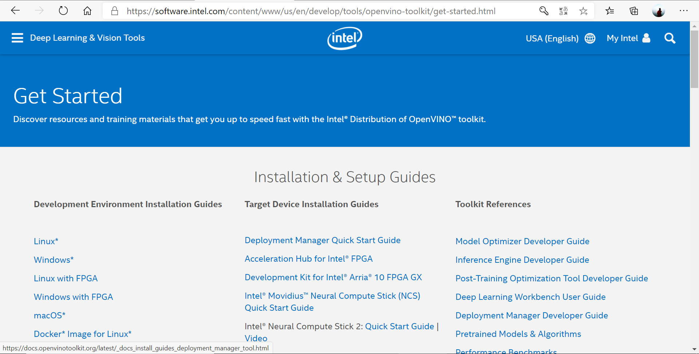

3. 选择Windows*进行下载安装：

   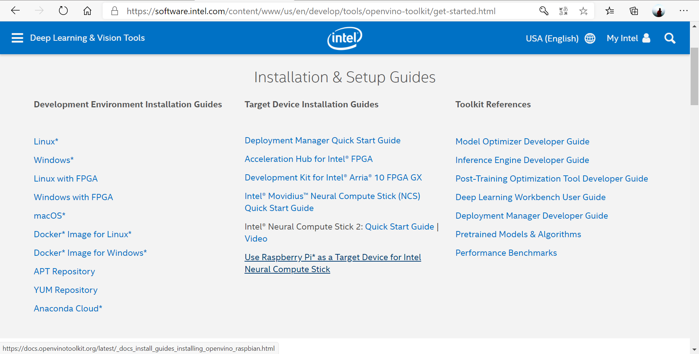

4. 安装完成。

## 二、安装工具包核心组件 ##
1. 进入官网下载OpenVINO工具包，网址：http://software.intel.com/en-us/openvino-toolkit/choose-download/free-download-windows。
2. 打开下载路径的文件夹，运行可执行文件w_openvino_toolkit_p_<version>.exe。
3. 安装过程中一直选择“下一步”即可。
4. 选择“Finish”关闭安装向导。

   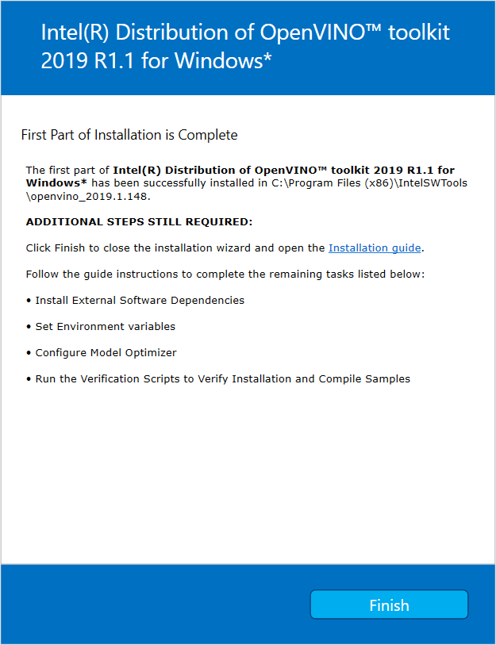

5. 安装完成。
   
## 三、安装Microsoft Visual Studio ##
1. 进入官网，网址：http://visualstudio.microsoft.com/downloads/
2. 进入主页，选择“社区”下的“免费下载”：
   
   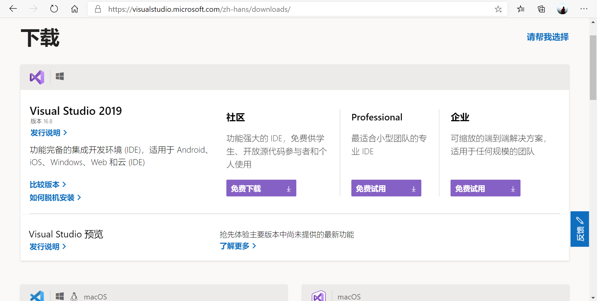

3. 下载结束后运行可执行文件安装程序。
4. 安装过程中选择通用Windows平台开发和使用C ++进行桌面开发；在Individual components选项卡下，选择MSBuild。
5. 其余安装选项默认即可。
6. 安装完成。

## 四、安装CMake ##
1. 进入官网，网址：https://cmake.org/download/。
2. 下滑至Windows win64-x64 Installer行。
   
   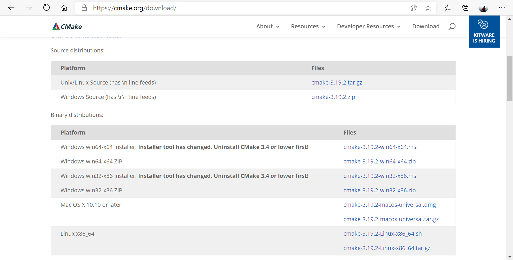

3. 单击关联的文件名，下载安装扩展名为.msi的程序。
4. 打开下载文件，运行可执行文件，安装过程中选择“将CMake添加到系统PATH”。
5. 根据默认路径安装即可。

## 五、安装Python 3.6.5 ##
1. 进入官网，网址：https://www.python.org/downloads/release/python-365/
   
   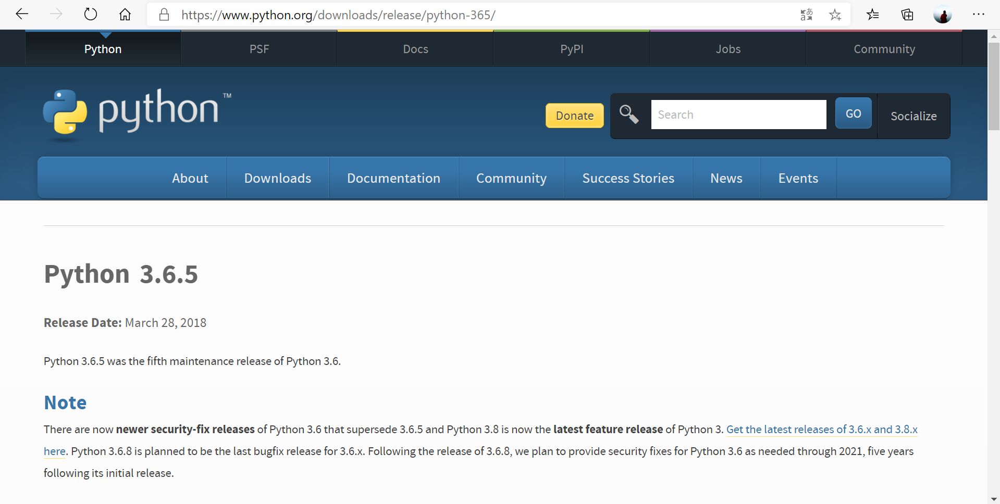

2. 单击Windows x86-64可执行安装程序以下载可执行文件。
   
   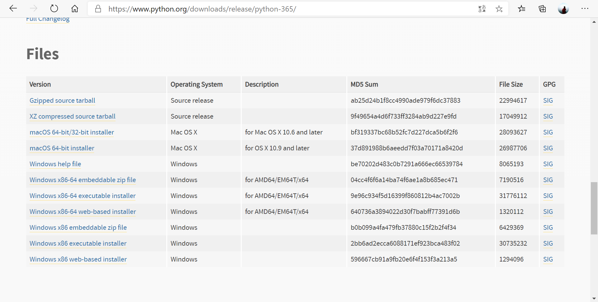

3. 运行可执行文件python-3.6.5-amd64.exe进行安装。
4. 安装选择默认路径及设置即可。

## 六、设置环境变量 ##
打开命令提示符并运行如下指令：

C:\Program Files(x86)\IntelSWTools\openvino\bin\setupvars.bat

临时设置环境变量。

## 七、配置模型优化器 ##
1. 进入如下目录：
   
   C:\Program Files (x86)\IntelSWTools\openvino\deployment_tools\model_optimizer\install_prerequisites

2. 运行以下文件：
   
   install_prerequisites.bat

## 八、运行示例 - 车辆目标 ##
### 下载预训练模型 ###

demo_security_barrier_camera.bat

用于车辆检测与车辆属性识别和车牌检测与车牌识别。

### 测试代码 ### 

```
:: Copyright (C) 2018-2019 Intel Corporation
:: SPDX-License-Identifier: Apache-2.0

@echo off
setlocal enabledelayedexpansion

set TARGET=CPU
set SAMPLE_OPTIONS=
set BUILD_FOLDER=%USERPROFILE%\Documents\Intel\OpenVINO

:: command line arguments parsing
:input_arguments_loop
if not "%1"=="" (
    if "%1"=="-d" (
        set TARGET=%2
        echo target = !TARGET!
        shift
    )
    if "%1"=="-sample-options" (
        set SAMPLE_OPTIONS=%2 %3 %4 %5 %6
        echo sample_options = !SAMPLE_OPTIONS!
        shift
    )
    if "%1"=="-help" (
        echo %~n0%~x0 is security barrier camera demo that showcases three models coming with the product
        echo.
        echo Options:
        echo -d name     Specify the target device to infer on; CPU, GPU, FPGA, HDDL or MYRIAD are acceptable. Sample will look for a suitable plugin for device specified
        exit /b
    )
    shift
    goto :input_arguments_loop
)

set ROOT_DIR=%~dp0

set target_image_path=%ROOT_DIR%car_1.bmp


set TARGET_PRECISION=FP16


echo target_precision = !TARGET_PRECISION!

if exist "%ROOT_DIR%..\..\bin\setupvars.bat" (
    call "%ROOT_DIR%..\..\bin\setupvars.bat"
) else (
    echo setupvars.bat is not found, INTEL_OPENVINO_DIR can't be set
    goto error
)

echo INTEL_OPENVINO_DIR is set to %INTEL_OPENVINO_DIR%

:: Check if Python is installed
python --version 2>NUL
if errorlevel 1 (
   echo Error^: Python is not installed. Please install Python 3.5 ^(64-bit^) or higher from https://www.python.org/downloads/
   goto error
)

:: Check if Python version is equal or higher 3.4
for /F "tokens=* USEBACKQ" %%F IN (`python --version 2^>^&1`) DO (
   set version=%%F
)
echo %var%

for /F "tokens=1,2,3 delims=. " %%a in ("%version%") do (
   set Major=%%b
   set Minor=%%c
)

if "%Major%" geq "3" (
   if "%Minor%" geq "5" (
  set python_ver=okay
   )
)
if not "%python_ver%"=="okay" (
   echo Unsupported Python version. Please install Python 3.5 ^(64-bit^) or higher from https://www.python.org/downloads/
   goto error
)

:: install yaml python modules required for downloader.py
pip3 install --user -r "%ROOT_DIR%..\open_model_zoo\tools\downloader\requirements.in"
if ERRORLEVEL 1 GOTO errorHandling


set models_path=%BUILD_FOLDER%\openvino_models\ir
set models_cache=%BUILD_FOLDER%\openvino_models\cache

if not exist "%models_cache%" (
  mkdir "%models_cache%"
)

set downloader_dir=%INTEL_OPENVINO_DIR%\deployment_tools\open_model_zoo\tools\downloader

for /F "tokens=1,2 usebackq" %%a in ("%ROOT_DIR%demo_security_barrier_camera.conf") do (
   echo python "%downloader_dir%\downloader.py" --name "%%b" --output_dir "%models_path%" --cache_dir "%models_cache%"
   python "%downloader_dir%\downloader.py" --name "%%b" --output_dir "%models_path%" --cache_dir "%models_cache%"

   for /F "tokens=* usebackq" %%d in (
      `python "%downloader_dir%\info_dumper.py" --name "%%b" ^|
         python -c "import sys, json; print(json.load(sys.stdin)[0]['subdirectory'])"`
   ) do (
      set model_args=!model_args! %%a "%models_path%\%%d\%target_precision%\%%b.xml"
   )
)

echo.
echo ###############^|^| Generate VS solution for Inference Engine demos using cmake ^|^|###############
echo.
timeout 3

if "%PROCESSOR_ARCHITECTURE%" == "AMD64" (
   set "PLATFORM=x64"
) else (
   set "PLATFORM=Win32"
)

set VSWHERE="false"
if exist "%ProgramFiles(x86)%\Microsoft Visual Studio\Installer\vswhere.exe" (
   set VSWHERE="true"
   cd "%ProgramFiles(x86)%\Microsoft Visual Studio\Installer"
) else if exist "%ProgramFiles%\Microsoft Visual Studio\Installer\vswhere.exe" (
      set VSWHERE="true"
      cd "%ProgramFiles%\Microsoft Visual Studio\Installer"
) else (
   echo "vswhere tool is not found"
)

set MSBUILD_BIN=
set VS_PATH=
```

### 测试结果如下 ###

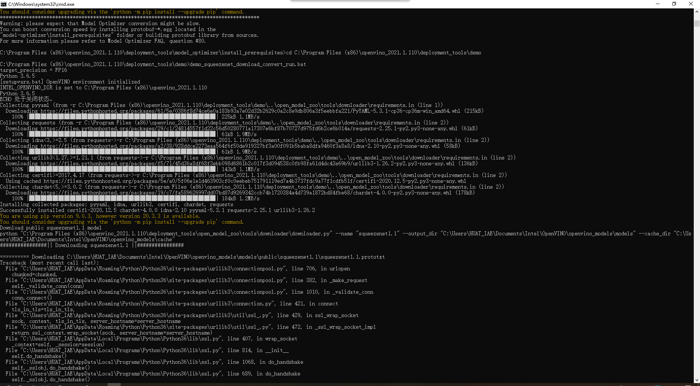

测试结果如下：

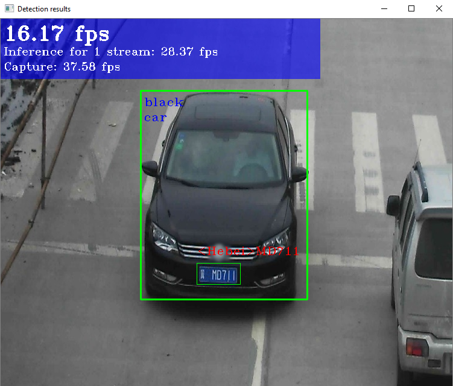

测试界面如下：

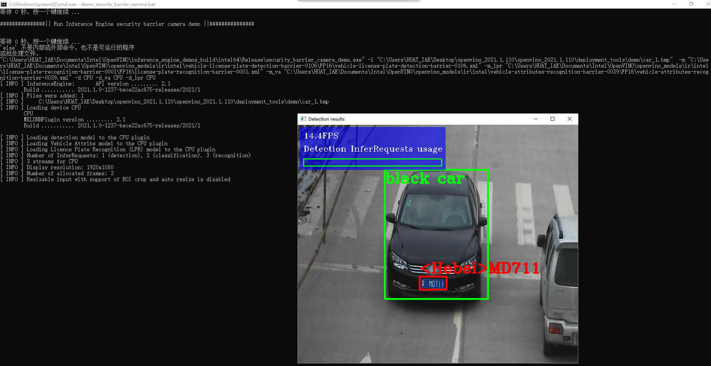


# OpenVINO 人脸识别 #

## 实验步骤 ##

1. 在python环境中加载openvino，打开openvino安装目录，把目录下的openvino文件夹复制到系统的python环境安装目录下。
2. C:\Intel\openvino\deployment_tools\inference_engine\samples 路径下执行文件：build_samples_msvc.bat。
   
    执行完后在C:\Users\kang\Documents\Intel\OpenVINO 目录可以找到生成的文件目录：inference_engine_samples_build。 

    在build目录中可以找到cpu_extension：cpu_extension = “C:\Users\kang\Documents\Intel\OpenVINO\inference_engine_samples_build\intel64\Release\cpu_extension.dll”。

3. 下载模型，记录路径并记录xml地址。

## 代码如下 ##

```
import sys
import cv2
import numpy as np
import time
import logging as log
from openvino.inference_engine import IENetwork, IEPlugin
model_xml = "C:/Users/kang/Downloads/open_model_zoo-2019/model_downloader/Transportation/object_detection/face/pruned_mobilenet_reduced_ssd_shared_weights/dldt/face-detection-adas-0001.xml"
model_bin = "C:/Users/kang/Downloads/open_model_zoo-2019/model_downloader/Transportation/object_detection/face/pruned_mobilenet_reduced_ssd_shared_weights/dldt/face-detection-adas-0001.bin"
plugin_dir = "C:/Intel/openvino/deployment_tools/inference_engine/bin/intel64/Release"
cpu_extension = "C:/Users/kang/Documents/Intel/OpenVINO/inference_engine_samples_build_2017/intel64/Release/cpu_extension.dll"

landmark_xml = "C:/Users/kang/Downloads/open_model_zoo-2019/model_downloader/Retail/object_attributes/landmarks_regression/0009/dldt/landmarks-regression-retail-0009.xml"
landmark_bin = "C:/Users/kang/Downloads/open_model_zoo-2019/model_downloader/Retail/object_attributes/landmarks_regression/0009/dldt/landmarks-regression-retail-0009.bin"


def face_landmark_demo():
    log.basicConfig(format="[ %(levelname)s ] %(message)s",
                    level=log.INFO,
                    stream=sys.stdout)
    # Plugin initialization for specified device and load extensions library if specified
    log.info("Initializing plugin for {} device...".format("CPU"))
    plugin = IEPlugin(device="CPU", plugin_dirs=plugin_dir)
    plugin.add_cpu_extension(cpu_extension)

    # lut
    lut = []
    lut.append((0, 0, 255))
    lut.append((255, 0, 0))
    lut.append((0, 255, 0))
    lut.append((0, 255, 255))
    lut.append((255, 0, 255))

    # Read IR
    log.info("Reading IR...")
    net = IENetwork(model=model_xml, weights=model_bin)
    landmark_net = IENetwork(model=landmark_xml, weights=landmark_bin)

    if plugin.device == "CPU":
        supported_layers = plugin.get_supported_layers(net)
        not_supported_layers = [
            l for l in net.layers.keys() if l not in supported_layers
        ]
        if len(not_supported_layers) != 0:
            log.error(
                "Following layers are not supported by the plugin for specified device {}:\n {}"
                .format(plugin.device, ', '.join(not_supported_layers)))
            log.error(
                "Please try to specify cpu extensions library path in demo's command line parameters using -l "
                "or --cpu_extension command line argument")
            sys.exit(1)
    assert len(
        net.inputs.keys()) == 1, "Demo supports only single input topologies"
    assert len(net.outputs) == 1, "Demo supports only single output topologies"

    input_blob = next(iter(net.inputs))
    out_blob = next(iter(net.outputs))

    lm_input_blob = next(iter(landmark_net.inputs))
    lm_out_blob = next(iter(landmark_net.outputs))

    log.info("Loading IR to the plugin...")
    exec_net = plugin.load(network=net, num_requests=2)
    lm_exec_net = plugin.load(network=landmark_net)

    # Read and pre-process input image
    n, c, h, w = net.inputs[input_blob].shape
    nm, cm, hm, wm = landmark_net.inputs[lm_input_blob].shape

    del net
    del landmark_net

    cap = cv2.VideoCapture("C:/Users/kang/Downloads/material/av77002671.mp4")

    cur_request_id = 0
    next_request_id = 1

    log.info("Starting inference in async mode...")
    log.info("To switch between sync and async modes press Tab button")
    log.info("To stop the demo execution press Esc button")
    is_async_mode = True
    render_time = 0
    ret, frame = cap.read()

    print(
        "To close the application, press 'CTRL+C' or any key with focus on the output window"
    )
    while cap.isOpened():
        if is_async_mode:
            ret, next_frame = cap.read()
        else:
            ret, frame = cap.read()
        if not ret:
            break
        initial_w = cap.get(3)
        initial_h = cap.get(4)
        inf_start = time.time()
        if is_async_mode:
            in_frame = cv2.resize(next_frame, (w, h))
            in_frame = in_frame.transpose(
                (2, 0, 1))  # Change data layout from HWC to CHW
            in_frame = in_frame.reshape((n, c, h, w))
            exec_net.start_async(request_id=next_request_id,
                                inputs={input_blob: in_frame})
        else:
            in_frame = cv2.resize(frame, (w, h))
            in_frame = in_frame.transpose(
                (2, 0, 1))  # Change data layout from HWC to CHW
            in_frame = in_frame.reshape((n, c, h, w))
            exec_net.start_async(request_id=cur_request_id,
                                inputs={input_blob: in_frame})
        if exec_net.requests[cur_request_id].wait(-1) == 0:

            res = exec_net.requests[cur_request_id].outputs[out_blob]
            for obj in res[0][0]:
                if obj[2] > 0.5:
                    xmin = int(obj[3] * initial_w)
                    ymin = int(obj[4] * initial_h)
                    xmax = int(obj[5] * initial_w)
                    ymax = int(obj[6] * initial_h)
                    if xmin > 0 and ymin > 0 and (xmax < initial_w) and (
                            ymax < initial_h):
                        roi = frame[ymin:ymax, xmin:xmax, :]
                        rh, rw = roi.shape[:2]
                        face_roi = cv2.resize(roi, (wm, hm))
                        face_roi = face_roi.transpose((2, 0, 1))
                        face_roi = face_roi.reshape((nm, cm, hm, wm))
                        lm_exec_net.infer(inputs={'0': face_roi})
                        landmark_res = lm_exec_net.requests[0].outputs[
                            lm_out_blob]
                        landmark_res = np.reshape(landmark_res, (5, 2))
                        for m in range(len(landmark_res)):
                            x = landmark_res[m][0] * rw
                            y = landmark_res[m][1] * rh
                            cv2.circle(roi, (np.int32(x), np.int32(y)), 3,
                                    lut[m], 2, 8, 0)

                    cv2.rectangle(frame, (xmin, ymin), (xmax, ymax),
                                (0, 0, 255), 2, 8, 0)

            inf_end = time.time()
            det_time = inf_end - inf_start

            # Draw performance stats
            inf_time_message = "Inference time: {:.3f} ms, FPS:{:.3f}".format(
                det_time * 1000, 1000 / (det_time * 1000 + 1))
            render_time_message = "OpenCV rendering time: {:.3f} ms".format(
                render_time * 1000)
            async_mode_message = "Async mode is on. Processing request {}".format(cur_request_id) if is_async_mode else \
                "Async mode is off. Processing request {}".format(cur_request_id)

            cv2.putText(frame, inf_time_message, (15, 15),
                        cv2.FONT_HERSHEY_COMPLEX, 0.5, (200, 10, 10), 1)
            cv2.putText(frame, render_time_message, (15, 30),
                        cv2.FONT_HERSHEY_COMPLEX, 0.5, (10, 10, 200), 1)
            cv2.putText(frame, async_mode_message, (10, int(initial_h - 20)),
                        cv2.FONT_HERSHEY_COMPLEX, 0.5, (10, 10, 200), 1)

        render_start = time.time()
        cv2.imshow("face detection", frame)
        render_end = time.time()
        render_time = render_end - render_start

        if is_async_mode:
            cur_request_id, next_request_id = next_request_id, cur_request_id
            frame = next_frame

        key = cv2.waitKey(1)
        if key == 27:
            break

    cv2.destroyAllWindows()
    del exec_net
    del lm_exec_net
    del plugin


if __name__ == '__main__':
    sys.exit(face_landmark_demo() or 0)

```

## 检测结果图 ##

检测原图：


检测结果：

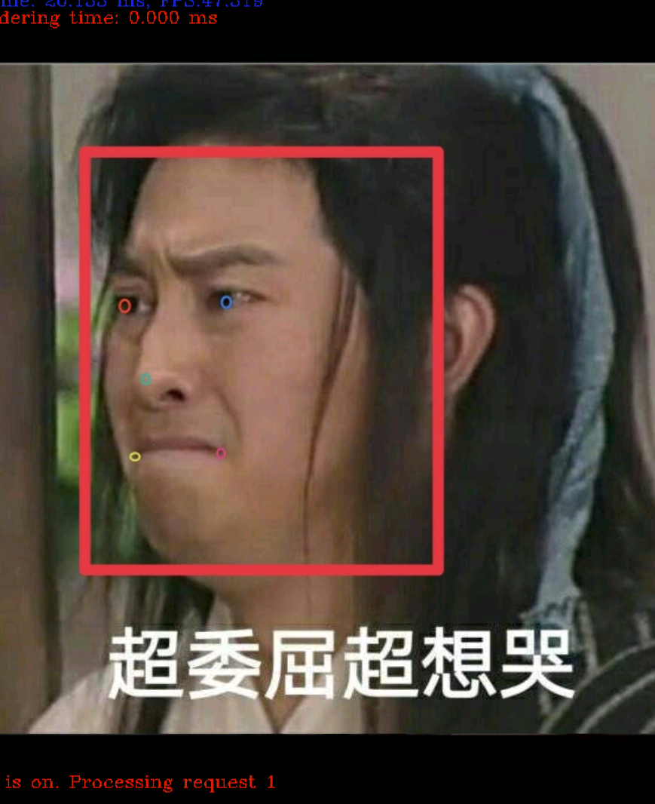


# OpenVINO 人脸识别与表情检测 #

## 实验步骤 ##
1. 在python环境中加载openvino，打开openvino安装目录，并将目录下的openvino文件夹复制到系统的python环境安装目录下。
2. 在C:\Intel\openvino\deployment_tools\inference_engine\samples 路径下执行文件：build_samples_msvc.bat。

   执行完后在C:\Users\kang\Documents\Intel\OpenVINO 目录下生成inference_engine_samples_build 文件目录。

   在build目录中也可以找到cpu_extension：
cpu_extension = “C:\Users\kang\Documents\Intel\OpenVINO\inference_engine_samples_build\intel64\Release\cpu_extension.dll”。

下载模型，并记录路径。

## 测试代码 ##

```
import sys
import cv2
import numpy as np
import time
import logging as log
from openvino.inference_engine import IENetwork, IEPlugin

plugin_dir = "C:/Intel/openvino/deployment_tools/inference_engine/bin/intel64/Release"
cpu_extension = "C:/Users/kang/Documents/Intel/OpenVINO/inference_engine_samples_build_2017/intel64/Release/cpu_extension.dll"


# face-detection-adas-0001
model_xml  = "C:/Users/kang/Downloads/openvino_sample_show/open_model_zoo/model_downloader/Transportation/object_detection/face/pruned_mobilenet_reduced_ssd_shared_weights/dldt/face-detection-adas-0001.xml"
model_bin = "C:/Users/kang/Downloads/openvino_sample_show/open_model_zoo/model_downloader/Transportation/object_detection/face/pruned_mobilenet_reduced_ssd_shared_weights/dldt/face-detection-adas-0001.bin"

# emotions-recognition-retail-0003
emotions_xml = "C:/Users/kang/Downloads/openvino_sample_show/open_model_zoo/model_downloader/Retail/object_attributes/emotions_recognition/0003/dldt/emotions-recognition-retail-0003.xml"
emotions_bin = "C:/Users/kang/Downloads/openvino_sample_show/open_model_zoo/model_downloader/Retail/object_attributes/emotions_recognition/0003/dldt/emotions-recognition-retail-0003.bin"

labels = ['neutral', 'happy', 'sad', 'surprise', 'anger']


def face_emotions_demo():
    log.basicConfig(format="[ %(levelname)s ] %(message)s",
                    level=log.INFO,
                    stream=sys.stdout)
    # Plugin initialization for specified device and load extensions library if specified
    log.info("Initializing plugin for {} device...".format("CPU"))
    plugin = IEPlugin(device="CPU", plugin_dirs=plugin_dir)
    plugin.add_cpu_extension(cpu_extension)
    # Read IR
    log.info("Reading IR...")
    net = IENetwork(model=model_xml, weights=model_bin)


    emotions_net = IENetwork(model=emotions_xml, weights=emotions_bin)

    if plugin.device == "CPU":
        supported_layers = plugin.get_supported_layers(net)
        not_supported_layers = [
            l for l in net.layers.keys() if l not in supported_layers
        ]
        if len(not_supported_layers) != 0:
            log.error(
                "Following layers are not supported by the plugin for specified device {}:\n {}"
                .format(plugin.device, ', '.join(not_supported_layers)))
            log.error(
                "Please try to specify cpu extensions library path in demo's command line parameters using -l "
                "or --cpu_extension command line argument")
            sys.exit(1)
    assert len(
        net.inputs.keys()) == 1, "Demo supports only single input topologies"
    assert len(net.outputs) == 1, "Demo supports only single output topologies"


    input_blob = next(iter(net.inputs))
    out_blob = next(iter(net.outputs))
    em_input_blob = next(iter(emotions_net.inputs))
    em_out_blob = next(iter(emotions_net.outputs))


    log.info("Loading IR to the plugin...")

    # 生成可执行网络,异步执行 num_requests=2
    exec_net = plugin.load(network=net, num_requests=2)
    exec_emotions_net = plugin.load(network=emotions_net)

    # Read and pre-process input image
    n, c, h, w = net.inputs[input_blob].shape
    en, ec, eh, ew = emotions_net.inputs[em_input_blob].shape

    del net
    del emotions_net

    cap = cv2.VideoCapture("C:/Users/kang/Downloads/openvino_sample_show/material/face_detection_demo.mp4")

    cur_request_id = 0
    next_request_id = 1

    log.info("Starting inference in async mode...")
    log.info("To switch between sync and async modes press Tab button")
    log.info("To stop the demo execution press Esc button")
    is_async_mode = True
    render_time = 0
    ret, frame = cap.read()

    print(
        "To close the application, press 'CTRL+C' or any key with focus on the output window"
    )
    while cap.isOpened():
        if is_async_mode:
            ret, next_frame = cap.read()
        else:
            ret, frame = cap.read()
        if not ret:
            break
        initial_w = cap.get(3)
        initial_h = cap.get(4)
        inf_start = time.time()
        if is_async_mode:
            in_frame = cv2.resize(next_frame, (w, h))
            in_frame = in_frame.transpose(
                (2, 0, 1))  # Change data layout from HWC to CHW
            in_frame = in_frame.reshape((n, c, h, w))
            exec_net.start_async(request_id=next_request_id,
                                inputs={input_blob: in_frame})
        else:
            in_frame = cv2.resize(frame, (w, h))
            in_frame = in_frame.transpose(
                (2, 0, 1))  # Change data layout from HWC to CHW
            in_frame = in_frame.reshape((n, c, h, w))
            exec_net.start_async(request_id=cur_request_id,
                                inputs={input_blob: in_frame})
        if exec_net.requests[cur_request_id].wait(-1) == 0:


            res = exec_net.requests[cur_request_id].outputs[out_blob]


            # 输出格式：[1,1,N,7]  从N行人脸中找到7个值   = [image_id,label,conf,x_min,y_min,x_max,y_max]
            for obj in res[0][0]:
                if obj[2] > 0.5:
                    xmin = int(obj[3] * initial_w)
                    ymin = int(obj[4] * initial_h)
                    xmax = int(obj[5] * initial_w)
                    ymax = int(obj[6] * initial_h)
                    if xmin > 0 and ymin > 0 and (xmax < initial_w) and (ymax < initial_h):
                        roi = frame[ymin:ymax,xmin:xmax,:]
                        face_roi = cv2.resize(roi,(ew,eh))
                        face_roi =face_roi.transpose((2, 0, 1)) 
                        face_roi= face_roi.reshape((en, ec, eh, ew))
                        # 解析结果
                        landmark_res = exec_emotions_net.infer(inputs={input_blob: [face_roi]})
                        landmark_res = landmark_res['prob_emotion']
                        landmark_res = np.reshape(landmark_res, (5))
                        landmark_res = labels[np.argmax(landmark_res)]
                        cv2.putText(frame, landmark_res, (np.int32(xmin), np.int32(ymin)), cv2.FONT_HERSHEY_SIMPLEX, 1.0,
                                (255, 0, 0), 2)
                        cv2.rectangle(frame, (np.int32(xmin), np.int32(ymin)), (np.int32(xmax), np.int32(ymax)),
                                    (0, 0, 255), 2, 8, 0)
                    cv2.rectangle(frame, (xmin,ymin), (xmax,ymax), (0, 0, 255), 2, 8, 0)


            inf_end = time.time()
            det_time = inf_end - inf_start

            # Draw performance stats
            inf_time_message = "Inference time: {:.3f} ms, FPS:{:.3f}".format(det_time * 1000, 1000 / (det_time*1000 + 1))
            render_time_message = "OpenCV rendering time: {:.3f} ms".format(
                render_time * 1000)
            async_mode_message = "Async mode is on. Processing request {}".format(cur_request_id) if is_async_mode else \
                "Async mode is off. Processing request {}".format(cur_request_id)

            cv2.putText(frame, inf_time_message, (15, 15),
                        cv2.FONT_HERSHEY_COMPLEX, 0.5, (200, 10, 10), 1)
            cv2.putText(frame, render_time_message, (15, 30),
                        cv2.FONT_HERSHEY_COMPLEX, 0.5, (10, 10, 200), 1)
            cv2.putText(frame, async_mode_message, (10, int(initial_h - 20)),
                        cv2.FONT_HERSHEY_COMPLEX, 0.5, (10, 10, 200), 1)


        render_start = time.time()
        cv2.imshow("face emotions demo", frame)
        render_end = time.time()
        render_time = render_end - render_start

        if is_async_mode:
            cur_request_id, next_request_id = next_request_id, cur_request_id
            frame = next_frame

        key = cv2.waitKey(1)
        if key == 27:
            break
    cv2.destroyAllWindows()

    del exec_net
    del exec_emotions_net
    del plugin


if __name__ == '__main__':
    sys.exit(face_emotions_demo() or 0) 


```

## 检测结果图 ##

检测原图：


检测结果：

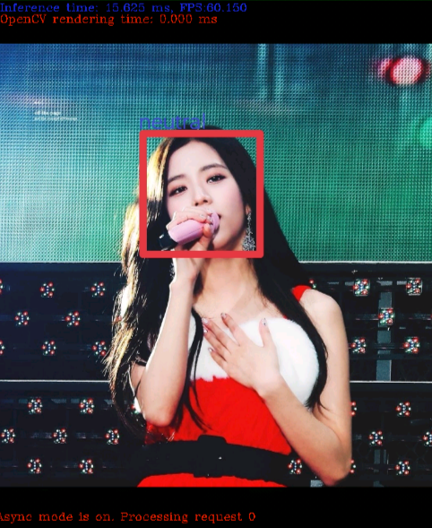


# 实验总结与心得体会 #

OpenVINO是英特尔推出的一款全面的工具套件，用于快速部署应用和解决方案，支持计算机视觉的CNN网络结构超过150余种。OpenVINO提供了深度学习推理套件，该套件可以将各种开源框架训练好的模型进行线上部署。

在这次实验中，我选择使用OpenVINO进行人脸识别。在实验中遇到了很多的问题。在环境的配置中，python的安装包缺少pip文件，同时在设置系统环境变量的时候出现遗漏与错误。解决时间花费较久，在这方面还需要锻炼。

通过此次的实验，我更加认识到了动手能力和理论知识的重要性，理论与实践的结合更是重中之重，我也深刻地认识到我们的不足。由于理论知识不够完善、动手能力有待提高，在实验过程中的基础设置部分就花费了较多的时间。庆幸的是最后还是在老师以及同学的帮助下很好的解决了这些问题，完成了实验，且实验结果较为满意。