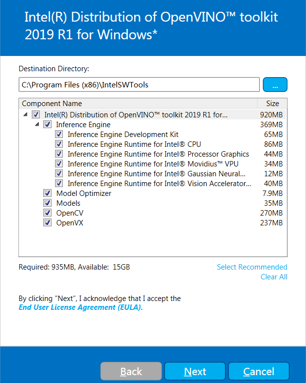
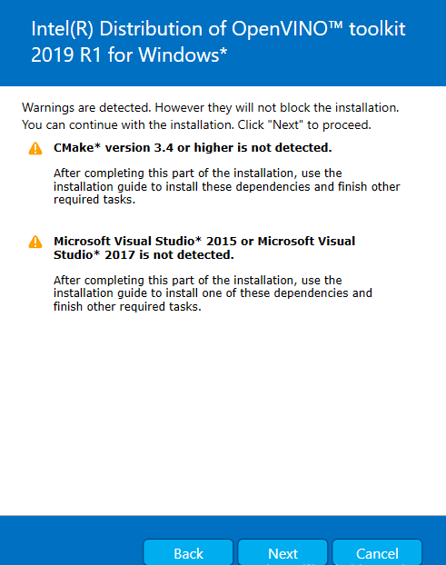
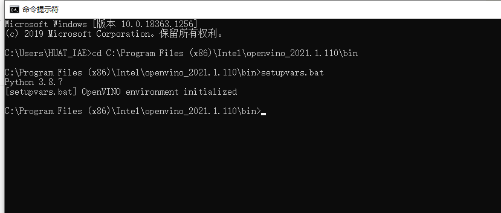
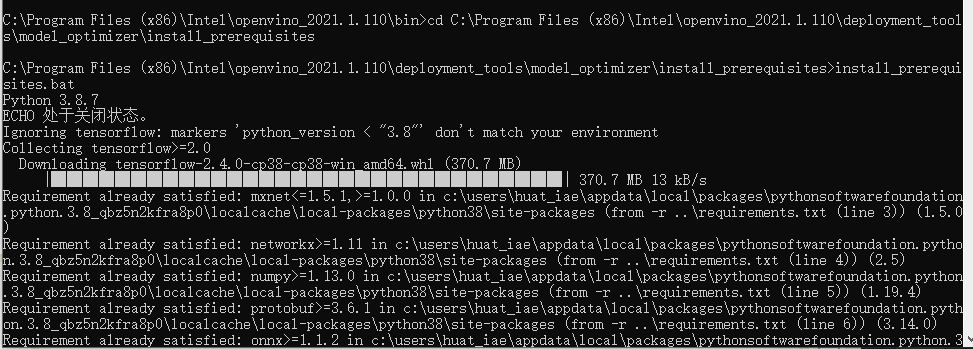
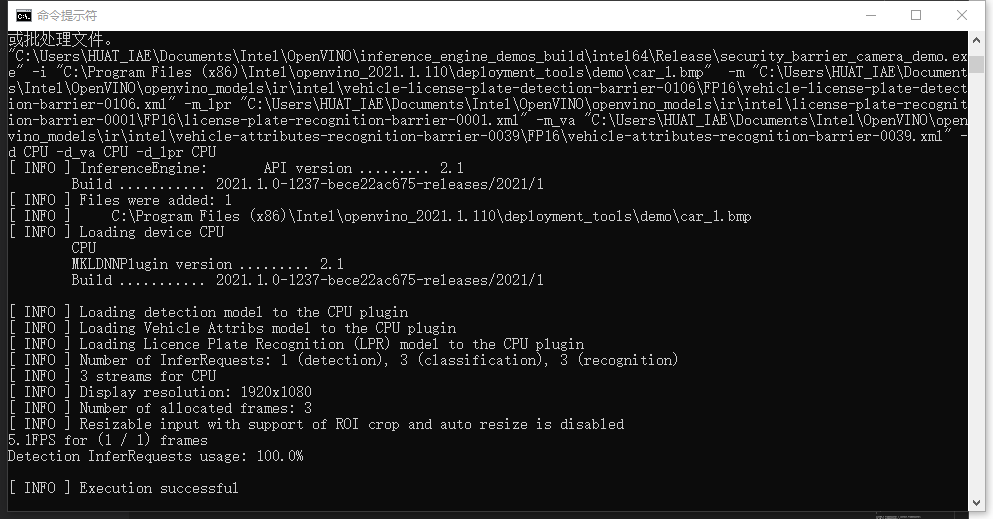
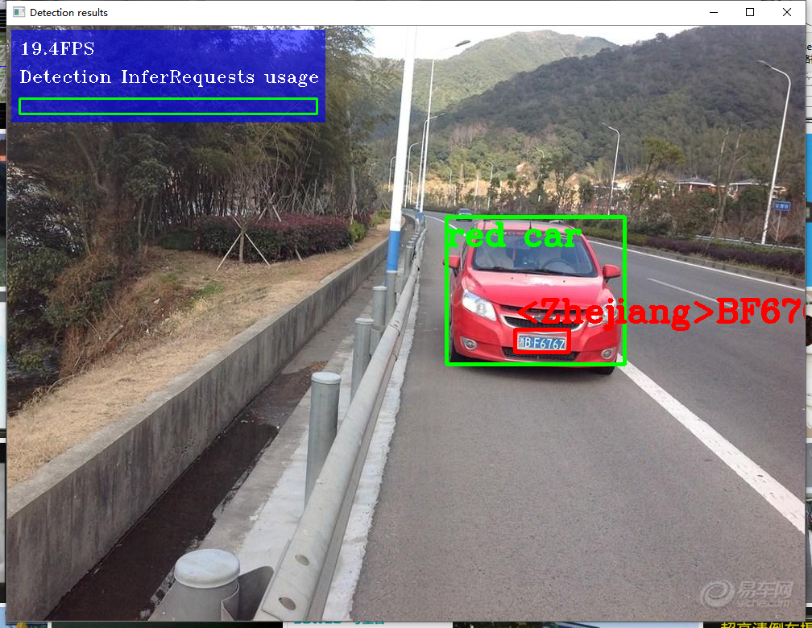
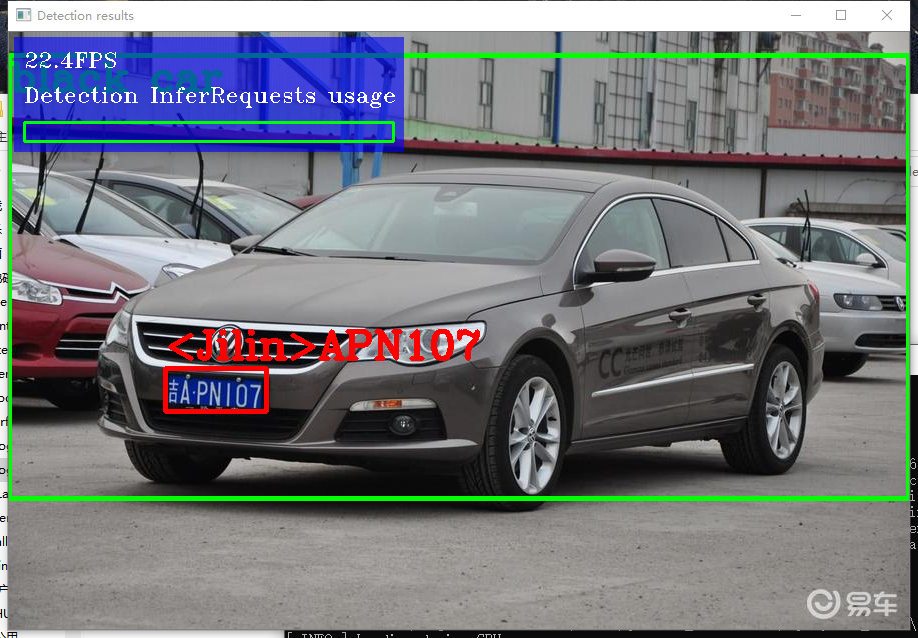
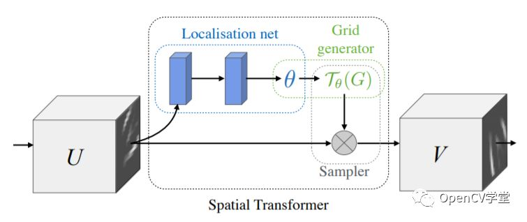

# 课程设计
## 基于OpenVINO的车辆目标检测

####  一、Windows环境下Openvino安装与配置

####  1.下载OpenVINO
下载地址：https://software.seek.intel.com/openvino-toolkit?os=windows
需要先注册，邮箱会收到下载链接和Serial Number来激活软件。
选择安装路径

接着一直下一步，提示python版本不满足>=3.6，可以先忽略安装。

检测依赖库
Microsoft Visual Studio* with C++ 2017 or 2015, with MSBuild, and the Build Tools for Microsoft Visual Studio
CMake>=3.4
Python>=3.6.5
一般安装vs2015或者2017的，第一项已经满足。



####  2.安装依赖包
1、Visual Studio电脑已安装
2、下载CMake >=3.4
下载地址：https://cmake.org/download/
3、下载Python>=3.6
下载地址：https://www.anaconda.com/distribution/

####  3.设置环境变量
进入C:\Program Files (x86)\Intel\openvino_2021.1.110\bin目录下，运行setupvars.bat


####  4.配置模型优化器
进入C:\Program Files (x86)\Intel\openvino_2021.1.110\deployment_tools\model_optimizer\install_prerequisites目录运行install_prerequisites.bat


####  5.代码
```PythonPython
// Copyright (C) 2018-2019 Intel Corporation
// SPDX-License-Identifier: Apache-2.0
//

#include <algorithm>
#include <chrono>
#include <iomanip>
#include <list>
#include <map>
#include <memory>
#include <stdexcept>
#include <string>
#include <utility>
#include <vector>
#include <set>

#include <cldnn/cldnn_config.hpp>
#include <inference_engine.hpp>
#include <vpu/vpu_plugin_config.hpp>
#include <monitors/presenter.h>
#include <samples/args_helper.hpp>
#include <samples/ocv_common.hpp>
#include <samples/slog.hpp>

#include "common.hpp"
#include "grid_mat.hpp"
#include "input_wrappers.hpp"
#include "security_barrier_camera_demo.hpp"
#include "net_wrappers.hpp"

using namespace InferenceEngine;

typedef std::chrono::duration<float, std::chrono::seconds::period> Sec;

bool ParseAndCheckCommandLine(int argc, char *argv[]) {
    // ---------------------------Parsing and validation of input args--------------------------------------
    gflags::ParseCommandLineNonHelpFlags(&argc, &argv, true);
    if (FLAGS_h) {
        showUsage();
        showAvailableDevices();
        return false;
    }

    if (FLAGS_m.empty()) {
        throw std::logic_error("Parameter -m is not set");
    }
    if (FLAGS_nc == 0 && FLAGS_i.empty()) {
        throw std::logic_error("Please specify at least one video source(web cam or video file)");
    }
    if (FLAGS_display_resolution.find("x") == std::string::npos) {
        throw std::logic_error("Incorrect format of -displayresolution parameter. Correct format is  \"width\"x\"height\". For example \"1920x1080\"");
    }
    if (FLAGS_n_wt == 0) {
        throw std::logic_error("-n_wt can not be zero");
    }
    return true;
}

struct BboxAndDescr {
    enum class ObjectType {
        NONE,
        VEHICLE,
        PLATE,
    } objectType;
    cv::Rect rect;
    std::string descr;
};

struct InferRequestsContainer {
    InferRequestsContainer() = default;
    InferRequestsContainer(const InferRequestsContainer&) = delete;
    InferRequestsContainer& operator=(const InferRequestsContainer&) = delete;

    void assign(const std::vector<InferRequest>& inferRequests) {
        actualInferRequests = inferRequests;
        this->inferRequests.container.clear();

        for (auto& ir : this->actualInferRequests) {
            this->inferRequests.container.push_back(ir);
        }
    }

    std::vector<InferRequest> getActualInferRequests() {
        return actualInferRequests;
    }
    ConcurrentContainer<std::vector<std::reference_wrapper<InferRequest>>> inferRequests;

private:
    std::vector<InferRequest> actualInferRequests;
};

struct Context {  // stores all global data for tasks
    Context(const std::vector<std::shared_ptr<InputChannel>>& inputChannels,
            const Detector& detector,
            const VehicleAttributesClassifier& vehicleAttributesClassifier, const Lpr& lpr,
            int pause, const std::vector<cv::Size>& gridParam, cv::Size displayResolution, std::chrono::steady_clock::duration showPeriod,
                const std::string& monitorsStr,
            uint64_t lastFrameId,
            uint64_t nireq,
            bool isVideo,
            std::size_t nclassifiersireq, std::size_t nrecognizersireq):
        readersContext{inputChannels, std::vector<int64_t>(inputChannels.size(), -1), std::vector<std::mutex>(inputChannels.size())},
        inferTasksContext{detector},
        detectionsProcessorsContext{vehicleAttributesClassifier, lpr},
        drawersContext{pause, gridParam, displayResolution, showPeriod, monitorsStr},
        videoFramesContext{std::vector<uint64_t>(inputChannels.size(), lastFrameId), std::vector<std::mutex>(inputChannels.size())},
        nireq{nireq},
        isVideo{isVideo},
        t0{std::chrono::steady_clock::time_point()},
        freeDetectionInfersCount{0},
        frameCounter{0}
    {
        assert(inputChannels.size() == gridParam.size());
        std::vector<InferRequest> detectorInferRequests;
        std::vector<InferRequest> attributesInferRequests;
        std::vector<InferRequest> lprInferRequests;
        detectorInferRequests.reserve(nireq);
        attributesInferRequests.reserve(nclassifiersireq);
        lprInferRequests.reserve(nrecognizersireq);
        std::generate_n(std::back_inserter(detectorInferRequests), nireq, [&]{
            return inferTasksContext.detector.createInferRequest();});
        std::generate_n(std::back_inserter(attributesInferRequests), nclassifiersireq, [&]{
            return detectionsProcessorsContext.vehicleAttributesClassifier.createInferRequest();});
        std::generate_n(std::back_inserter(lprInferRequests), nrecognizersireq, [&]{
            return detectionsProcessorsContext.lpr.createInferRequest();});
        detectorsInfers.assign(detectorInferRequests);
        attributesInfers.assign(attributesInferRequests);
        platesInfers.assign(lprInferRequests);
    }
    struct {
        std::vector<std::shared_ptr<InputChannel>> inputChannels;
        std::vector<int64_t> lastCapturedFrameIds;
        std::vector<std::mutex> lastCapturedFrameIdsMutexes;
        std::weak_ptr<Worker> readersWorker;
    } readersContext;
    struct {
        Detector detector;
        std::weak_ptr<Worker> inferTasksWorker;
    } inferTasksContext;
    struct {
        VehicleAttributesClassifier vehicleAttributesClassifier;
        Lpr lpr;
        std::weak_ptr<Worker> detectionsProcessorsWorker;
    } detectionsProcessorsContext;
    struct DrawersContext {
        DrawersContext(int pause, const std::vector<cv::Size>& gridParam, cv::Size displayResolution, std::chrono::steady_clock::duration showPeriod,
                       const std::string& monitorsStr):
            pause{pause}, gridParam{gridParam}, displayResolution{displayResolution}, showPeriod{showPeriod},
            lastShownframeId{0}, prevShow{std::chrono::steady_clock::time_point()}, framesAfterUpdate{0}, updateTime{std::chrono::steady_clock::time_point()},
            presenter{monitorsStr,
                GridMat(gridParam, displayResolution).outimg.rows - 70,
                cv::Size{GridMat(gridParam, displayResolution).outimg.cols / 4, 60}} {}
        int pause;
        std::vector<cv::Size> gridParam;
        cv::Size displayResolution;
        std::chrono::steady_clock::duration showPeriod;  // desiered frequency of imshow
        std::weak_ptr<Worker> drawersWorker;
        int64_t lastShownframeId;
        std::chrono::steady_clock::time_point prevShow;  // time stamp of previous imshow
        std::map<int64_t, GridMat> gridMats;
        std::mutex drawerMutex;
        std::ostringstream outThroughput;
        unsigned framesAfterUpdate;
        std::chrono::steady_clock::time_point updateTime;
        Presenter presenter;
    } drawersContext;
    struct {
        std::vector<uint64_t> lastframeIds;
        std::vector<std::mutex> lastFrameIdsMutexes;
    } videoFramesContext;
    std::weak_ptr<Worker> resAggregatorsWorker;
    std::mutex classifiersAggregatorPrintMutex;
    uint64_t nireq;
    bool isVideo;
    std::chrono::steady_clock::time_point t0;
    std::atomic<std::vector<InferRequest>::size_type> freeDetectionInfersCount;
    std::atomic<uint64_t> frameCounter;
    InferRequestsContainer detectorsInfers, attributesInfers, platesInfers;
};

class ReborningVideoFrame: public VideoFrame {
public:
    ReborningVideoFrame(Context& context, const unsigned sourceID, const int64_t frameId, const cv::Mat& frame = cv::Mat()) :
        VideoFrame{sourceID, frameId, frame}, context(context) {}  // can not write context{context} because of CentOS 7.4 compiler bug
    virtual ~ReborningVideoFrame();
    Context& context;
};

class Drawer: public Task {  // accumulates and shows processed frames
public:
    explicit Drawer(VideoFrame::Ptr sharedVideoFrame):
        Task{sharedVideoFrame, 1.0} {}
    bool isReady() override;
    void process() override;
};

class ResAggregator: public Task {  // draws results on the frame
public:
    ResAggregator(const VideoFrame::Ptr& sharedVideoFrame, std::list<BboxAndDescr>&& boxesAndDescrs):
        Task{sharedVideoFrame, 4.0}, boxesAndDescrs{std::move(boxesAndDescrs)} {}
    bool isReady() override {
        return true;
    }
    void process() override;
private:
    std::list<BboxAndDescr> boxesAndDescrs;
};

class ClassifiersAggregator {  // waits for all classifiers and recognisers accumulating results
public:
    std::string rawDetections;
    ConcurrentContainer<std::list<std::string>> rawAttributes;
    ConcurrentContainer<std::list<std::string>> rawDecodedPlates;

    explicit ClassifiersAggregator(const VideoFrame::Ptr& sharedVideoFrame):
        sharedVideoFrame{sharedVideoFrame} {}
    ~ClassifiersAggregator() {
        std::mutex& printMutex = static_cast<ReborningVideoFrame*>(sharedVideoFrame.get())->context.classifiersAggregatorPrintMutex;
        printMutex.lock();
        std::cout << rawDetections;
        for (const std::string& rawAttribute : rawAttributes.container) {  // destructor assures that none uses the container
            std::cout << rawAttribute;
        }
        for (const std::string& rawDecodedPlate : rawDecodedPlates.container) {
            std::cout << rawDecodedPlate;
        }
        printMutex.unlock();
        tryPush(static_cast<ReborningVideoFrame*>(sharedVideoFrame.get())->context.resAggregatorsWorker,
                std::make_shared<ResAggregator>(sharedVideoFrame, std::move(boxesAndDescrs)));
    }
    void push(BboxAndDescr&& bboxAndDescr) {
        boxesAndDescrs.lockedPush_back(std::move(bboxAndDescr));
    }
    const VideoFrame::Ptr sharedVideoFrame;

private:
    ConcurrentContainer<std::list<BboxAndDescr>> boxesAndDescrs;
};

class DetectionsProcessor: public Task {  // extracts detections from blob InferRequests and runs classifiers and recognisers
public:
    DetectionsProcessor(VideoFrame::Ptr sharedVideoFrame, InferRequest* inferRequest):
        Task{sharedVideoFrame, 1.0}, inferRequest{inferRequest}, requireGettingNumberOfDetections{true} {}
    DetectionsProcessor(VideoFrame::Ptr sharedVideoFrame, std::shared_ptr<ClassifiersAggregator>&& classifiersAggregator, std::list<cv::Rect>&& vehicleRects,
    std::list<cv::Rect>&& plateRects):
        Task{sharedVideoFrame, 1.0}, classifiersAggregator{std::move(classifiersAggregator)}, inferRequest{nullptr},
        vehicleRects{std::move(vehicleRects)}, plateRects{std::move(plateRects)}, requireGettingNumberOfDetections{false} {}
    bool isReady() override;
    void process() override;

private:
    std::shared_ptr<ClassifiersAggregator> classifiersAggregator;  // when no one stores this object we will draw
    InferRequest* inferRequest;
    std::list<cv::Rect> vehicleRects;
    std::list<cv::Rect> plateRects;
    std::vector<std::reference_wrapper<InferRequest>> reservedAttributesRequests;
    std::vector<std::reference_wrapper<InferRequest>> reservedLprRequests;
    bool requireGettingNumberOfDetections;
};

class InferTask: public Task {  // runs detection
public:
    explicit InferTask(VideoFrame::Ptr sharedVideoFrame):
        Task{sharedVideoFrame, 5.0} {}
    bool isReady() override;
    void process() override;
};

class Reader: public Task {
public:
    explicit Reader(VideoFrame::Ptr sharedVideoFrame):
        Task{sharedVideoFrame, 2.0} {}
    bool isReady() override;
    void process() override;
};

ReborningVideoFrame::~ReborningVideoFrame() {
    try {
        const std::shared_ptr<Worker>& worker = std::shared_ptr<Worker>(context.readersContext.readersWorker);
        context.videoFramesContext.lastFrameIdsMutexes[sourceID].lock();
        const auto frameId = ++context.videoFramesContext.lastframeIds[sourceID];
        context.videoFramesContext.lastFrameIdsMutexes[sourceID].unlock();
        std::shared_ptr<ReborningVideoFrame> reborn = std::make_shared<ReborningVideoFrame>(context, sourceID, frameId, frame);
        worker->push(std::make_shared<Reader>(reborn));
    } catch (const std::bad_weak_ptr&) {}
}

bool Drawer::isReady() {
    Context& context = static_cast<ReborningVideoFrame*>(sharedVideoFrame.get())->context;
    std::chrono::steady_clock::time_point prevShow = context.drawersContext.prevShow;
    std::chrono::steady_clock::duration showPeriod = context.drawersContext.showPeriod;
    if (1u == context.drawersContext.gridParam.size()) {
        if (std::chrono::steady_clock::now() - prevShow > showPeriod) {
            return true;
        } else {
            return false;
        }
    } else {
        std::map<int64_t, GridMat>& gridMats = context.drawersContext.gridMats;
        auto gridMatIt = gridMats.find(sharedVideoFrame->frameId);
        if (gridMats.end() == gridMatIt) {
            if (2 > gridMats.size()) {  // buffer size
                return true;
            } else {
                return false;
            }
        } else {
            if (1u == gridMatIt->second.getUnupdatedSourceIDs().size()) {
                if (context.drawersContext.lastShownframeId == sharedVideoFrame->frameId
                    && std::chrono::steady_clock::now() - prevShow > showPeriod) {
                    return true;
                } else {
                    return false;
                }
            } else {
                return true;
            }
        }
    }
}

void Drawer::process() {
    const int64_t frameId = sharedVideoFrame->frameId;
    Context& context = static_cast<ReborningVideoFrame*>(sharedVideoFrame.get())->context;
    std::map<int64_t, GridMat>& gridMats = context.drawersContext.gridMats;
    context.drawersContext.drawerMutex.lock();
    auto gridMatIt = gridMats.find(frameId);
    if (gridMats.end() == gridMatIt) {
        gridMatIt = gridMats.emplace(frameId, GridMat(context.drawersContext.gridParam,
                                                      context.drawersContext.displayResolution)).first;
    }

    gridMatIt->second.update(sharedVideoFrame->frame, sharedVideoFrame->sourceID);
    auto firstGridIt = gridMats.begin();
    int64_t& lastShownframeId = context.drawersContext.lastShownframeId;
    if (firstGridIt->first == lastShownframeId && firstGridIt->second.isFilled()) {
        lastShownframeId++;
        cv::Mat mat = firstGridIt->second.getMat();

        constexpr float OPACITY = 0.6f;
        fillROIColor(mat, cv::Rect(5, 5, 390, 115), cv::Scalar(255, 0, 0), OPACITY);
        cv::putText(mat, "Detection InferRequests usage", cv::Point2f(15, 70), cv::FONT_HERSHEY_TRIPLEX, 0.7, cv::Scalar{255, 255, 255});
        cv::Rect usage(15, 90, 370, 20);
        cv::rectangle(mat, usage, {0, 255, 0}, 2);
        uint64_t nireq = context.nireq;
        uint64_t frameCounter = context.frameCounter;
        usage.width = static_cast<int>(usage.width * static_cast<float>(frameCounter * nireq - context.freeDetectionInfersCount) / (frameCounter * nireq));
        cv::rectangle(mat, usage, {0, 255, 0}, cv::FILLED);

        context.drawersContext.framesAfterUpdate++;
        const std::chrono::steady_clock::time_point localT1 = std::chrono::steady_clock::now();
        const Sec timeDuration = localT1 - context.drawersContext.updateTime;
        if (Sec{1} <= timeDuration || context.drawersContext.updateTime == context.t0) {
            context.drawersContext.outThroughput.str("");
            context.drawersContext.outThroughput << std::fixed << std::setprecision(1)
                << static_cast<float>(context.drawersContext.framesAfterUpdate) / timeDuration.count() << "FPS";
            context.drawersContext.framesAfterUpdate = 0;
            context.drawersContext.updateTime = localT1;
        }
        cv::putText(mat, context.drawersContext.outThroughput.str(), cv::Point2f(15, 35), cv::FONT_HERSHEY_TRIPLEX, 0.7, cv::Scalar{255, 255, 255});

        context.drawersContext.presenter.drawGraphs(mat);

        cv::imshow("Detection results", firstGridIt->second.getMat());
        context.drawersContext.prevShow = std::chrono::steady_clock::now();
        const int key = cv::waitKey(context.drawersContext.pause);
        if (key == 27 || 'q' == key || 'Q' == key || !context.isVideo) {
            try {
                std::shared_ptr<Worker>(context.drawersContext.drawersWorker)->stop();
            } catch (const std::bad_weak_ptr&) {}
        } else if (key == 32) {
            context.drawersContext.pause = (context.drawersContext.pause + 1) & 1;
        } else {
            context.drawersContext.presenter.handleKey(key);
        }
        firstGridIt->second.clear();
        gridMats.emplace((--gridMats.end())->first + 1, firstGridIt->second);
        gridMats.erase(firstGridIt);
    }
    context.drawersContext.drawerMutex.unlock();
}

void ResAggregator::process() {
    Context& context = static_cast<ReborningVideoFrame*>(sharedVideoFrame.get())->context;
    context.freeDetectionInfersCount += context.detectorsInfers.inferRequests.lockedSize();
    context.frameCounter++;
    if (!FLAGS_no_show) {
        for (const BboxAndDescr& bboxAndDescr : boxesAndDescrs) {
            switch (bboxAndDescr.objectType) {
                case BboxAndDescr::ObjectType::NONE: cv::rectangle(sharedVideoFrame->frame, bboxAndDescr.rect, {255, 255, 0},  4);
                                                     break;
                case BboxAndDescr::ObjectType::VEHICLE: cv::rectangle(sharedVideoFrame->frame, bboxAndDescr.rect, {0, 255, 0},  4);
                                                         cv::putText(sharedVideoFrame->frame, bboxAndDescr.descr,
                                                                     cv::Point{bboxAndDescr.rect.x, bboxAndDescr.rect.y + 35},
                                                                     cv::FONT_HERSHEY_COMPLEX, 1.3, cv::Scalar(0, 255, 0), 4);
                                                         break;
                case BboxAndDescr::ObjectType::PLATE: cv::rectangle(sharedVideoFrame->frame, bboxAndDescr.rect, {0, 0, 255},  4);
                                                      cv::putText(sharedVideoFrame->frame, bboxAndDescr.descr,
                                                                  cv::Point{bboxAndDescr.rect.x, bboxAndDescr.rect.y - 10},
                                                                  cv::FONT_HERSHEY_COMPLEX, 1.3, cv::Scalar(0, 0, 255), 4);
                                                      break;
                default: throw std::exception();  // must never happen
                          break;
            }
        }
        tryPush(context.drawersContext.drawersWorker, std::make_shared<Drawer>(sharedVideoFrame));
    } else {
        if (!context.isVideo) {
           try {
                std::shared_ptr<Worker>(context.drawersContext.drawersWorker)->stop();
            } catch (const std::bad_weak_ptr&) {}
        }
    }
}

bool DetectionsProcessor::isReady() {
    Context& context = static_cast<ReborningVideoFrame*>(sharedVideoFrame.get())->context;
    if (requireGettingNumberOfDetections) {
        classifiersAggregator = std::make_shared<ClassifiersAggregator>(sharedVideoFrame);
        std::list<Detector::Result> results;
        if (!(FLAGS_r && ((sharedVideoFrame->frameId == 0 && !context.isVideo) || context.isVideo))) {
            results = context.inferTasksContext.detector.getResults(*inferRequest, sharedVideoFrame->frame.size());
        } else {
            std::ostringstream rawResultsStream;
            results = context.inferTasksContext.detector.getResults(*inferRequest, sharedVideoFrame->frame.size(), &rawResultsStream);
            classifiersAggregator->rawDetections = rawResultsStream.str();
        }
        for (Detector::Result result : results) {
            switch (result.label) {
                case 1:
                {
                    vehicleRects.emplace_back(result.location & cv::Rect{cv::Point(0, 0), sharedVideoFrame->frame.size()});
                    break;
                }
                case 2:
                {
                    // expanding a bounding box a bit, better for the license plate recognition
                    result.location.x -= 5;
                    result.location.y -= 5;
                    result.location.width += 10;
                    result.location.height += 10;
                    plateRects.emplace_back(result.location & cv::Rect{cv::Point(0, 0), sharedVideoFrame->frame.size()});
                    break;
                }
                default: throw std::exception();  // must never happen
                         break;
            }
        }
        context.detectorsInfers.inferRequests.lockedPush_back(*inferRequest);
        requireGettingNumberOfDetections = false;
    }

    if ((vehicleRects.empty() || FLAGS_m_va.empty()) && (plateRects.empty() || FLAGS_m_lpr.empty())) {
        return true;
    } else {
        // isReady() is called under mutexes so it is assured that available InferRequests will not be taken, but new InferRequests can come in
        // acquire as many InferRequests as it is possible or needed
        InferRequestsContainer& attributesInfers = context.attributesInfers;
        attributesInfers.inferRequests.mutex.lock();
        const std::size_t numberOfAttributesInferRequestsAcquired = std::min(vehicleRects.size(), attributesInfers.inferRequests.container.size());
        reservedAttributesRequests.assign(attributesInfers.inferRequests.container.end() - numberOfAttributesInferRequestsAcquired,
                                          attributesInfers.inferRequests.container.end());
        attributesInfers.inferRequests.container.erase(attributesInfers.inferRequests.container.end() - numberOfAttributesInferRequestsAcquired,
                                                       attributesInfers.inferRequests.container.end());
        attributesInfers.inferRequests.mutex.unlock();

        InferRequestsContainer& platesInfers = context.platesInfers;
        platesInfers.inferRequests.mutex.lock();
        const std::size_t numberOfLprInferRequestsAcquired = std::min(plateRects.size(), platesInfers.inferRequests.container.size());
        reservedLprRequests.assign(platesInfers.inferRequests.container.end() - numberOfLprInferRequestsAcquired, platesInfers.inferRequests.container.end());
        platesInfers.inferRequests.container.erase(platesInfers.inferRequests.container.end() - numberOfLprInferRequestsAcquired,
                                                   platesInfers.inferRequests.container.end());
        platesInfers.inferRequests.mutex.unlock();
        return numberOfAttributesInferRequestsAcquired || numberOfLprInferRequestsAcquired;
    }
}

void DetectionsProcessor::process() {
    Context& context = static_cast<ReborningVideoFrame*>(sharedVideoFrame.get())->context;
    if (!FLAGS_m_va.empty()) {
        auto vehicleRectsIt = vehicleRects.begin();
        for (auto attributesRequestIt = reservedAttributesRequests.begin(); attributesRequestIt != reservedAttributesRequests.end();
                vehicleRectsIt++, attributesRequestIt++) {
            const cv::Rect vehicleRect = *vehicleRectsIt;
            InferRequest& attributesRequest = *attributesRequestIt;
            context.detectionsProcessorsContext.vehicleAttributesClassifier.setImage(attributesRequest, sharedVideoFrame->frame, vehicleRect);

            attributesRequest.SetCompletionCallback(
                std::bind(
                    [](std::shared_ptr<ClassifiersAggregator> classifiersAggregator,
                        InferRequest& attributesRequest,
                        cv::Rect rect,
                        Context& context) {
                            attributesRequest.SetCompletionCallback([]{});  // destroy the stored bind object

                            const std::pair<std::string, std::string>& attributes
                                = context.detectionsProcessorsContext.vehicleAttributesClassifier.getResults(attributesRequest);

                            if (FLAGS_r && ((classifiersAggregator->sharedVideoFrame->frameId == 0 && !context.isVideo) || context.isVideo)) {
                                classifiersAggregator->rawAttributes.lockedPush_back("Vehicle Attributes results:" + attributes.first + ';'
                                                                                      + attributes.second + '\n');
                            }
                            classifiersAggregator->push(BboxAndDescr{BboxAndDescr::ObjectType::VEHICLE, rect, attributes.first + ' ' + attributes.second});
                            context.attributesInfers.inferRequests.lockedPush_back(attributesRequest);
                        }, classifiersAggregator,
                           std::ref(attributesRequest),
                           vehicleRect,
                           std::ref(context)));

            attributesRequest.StartAsync();
        }
        vehicleRects.erase(vehicleRects.begin(), vehicleRectsIt);
    } else {
        for (const cv::Rect vehicleRect : vehicleRects) {
            classifiersAggregator->push(BboxAndDescr{BboxAndDescr::ObjectType::NONE, vehicleRect, ""});
        }
        vehicleRects.clear();
    }

    if (!FLAGS_m_lpr.empty()) {
        auto plateRectsIt = plateRects.begin();
        for (auto lprRequestsIt = reservedLprRequests.begin(); lprRequestsIt != reservedLprRequests.end(); plateRectsIt++, lprRequestsIt++) {
            const cv::Rect plateRect = *plateRectsIt;
            InferRequest& lprRequest = *lprRequestsIt;
            context.detectionsProcessorsContext.lpr.setImage(lprRequest, sharedVideoFrame->frame, plateRect);

            lprRequest.SetCompletionCallback(
                std::bind(
                    [](std::shared_ptr<ClassifiersAggregator> classifiersAggregator,
                        InferRequest& lprRequest,
                        cv::Rect rect,
                        Context& context) {
                            lprRequest.SetCompletionCallback([]{});  // destroy the stored bind object

                            std::string result = context.detectionsProcessorsContext.lpr.getResults(lprRequest);

                            if (FLAGS_r && ((classifiersAggregator->sharedVideoFrame->frameId == 0 && !context.isVideo) || context.isVideo)) {
                                classifiersAggregator->rawDecodedPlates.lockedPush_back("License Plate Recognition results:" + result + '\n');
                            }
                            classifiersAggregator->push(BboxAndDescr{BboxAndDescr::ObjectType::PLATE, rect, std::move(result)});
                            context.platesInfers.inferRequests.lockedPush_back(lprRequest);
                        }, classifiersAggregator,
                           std::ref(lprRequest),
                           plateRect,
                           std::ref(context)));

            lprRequest.StartAsync();
        }
        plateRects.erase(plateRects.begin(), plateRectsIt);
    } else {
        for (const cv::Rect& plateRect : plateRects) {
            classifiersAggregator->push(BboxAndDescr{BboxAndDescr::ObjectType::NONE, plateRect, ""});
        }
        plateRects.clear();
    }
    if (!vehicleRects.empty() || !plateRects.empty()) {
        tryPush(context.detectionsProcessorsContext.detectionsProcessorsWorker,
            std::make_shared<DetectionsProcessor>(sharedVideoFrame, std::move(classifiersAggregator), std::move(vehicleRects), std::move(plateRects)));
    }
}

bool InferTask::isReady() {
    InferRequestsContainer& detectorsInfers = static_cast<ReborningVideoFrame*>(sharedVideoFrame.get())->context.detectorsInfers;
    if (detectorsInfers.inferRequests.container.empty()) {
        return false;
    } else {
        detectorsInfers.inferRequests.mutex.lock();
        if (detectorsInfers.inferRequests.container.empty()) {
            detectorsInfers.inferRequests.mutex.unlock();
            return false;
        } else {
            return true;  // process() will unlock the mutex
        }
    }
}

void InferTask::process() {
    Context& context = static_cast<ReborningVideoFrame*>(sharedVideoFrame.get())->context;
    InferRequestsContainer& detectorsInfers = context.detectorsInfers;
    std::reference_wrapper<InferRequest> inferRequest = detectorsInfers.inferRequests.container.back();
    detectorsInfers.inferRequests.container.pop_back();
    detectorsInfers.inferRequests.mutex.unlock();

    context.inferTasksContext.detector.setImage(inferRequest, sharedVideoFrame->frame);

    inferRequest.get().SetCompletionCallback(
        std::bind(
            [](VideoFrame::Ptr sharedVideoFrame,
               InferRequest& inferRequest,
               Context& context) {
                    inferRequest.SetCompletionCallback([]{});  // destroy the stored bind object
                    tryPush(context.detectionsProcessorsContext.detectionsProcessorsWorker,
                        std::make_shared<DetectionsProcessor>(sharedVideoFrame, &inferRequest));
                }, sharedVideoFrame,
                   inferRequest,
                   std::ref(context)));
    inferRequest.get().StartAsync();
    // do not push as callback does it
}

bool Reader::isReady() {
    Context& context = static_cast<ReborningVideoFrame*>(sharedVideoFrame.get())->context;
    context.readersContext.lastCapturedFrameIdsMutexes[sharedVideoFrame->sourceID].lock();
    if (context.readersContext.lastCapturedFrameIds[sharedVideoFrame->sourceID] + 1 == sharedVideoFrame->frameId) {
        return true;
    } else {
        context.readersContext.lastCapturedFrameIdsMutexes[sharedVideoFrame->sourceID].unlock();
        return false;
    }
}

void Reader::process() {
    unsigned sourceID = sharedVideoFrame->sourceID;
    Context& context = static_cast<ReborningVideoFrame*>(sharedVideoFrame.get())->context;
    const std::vector<std::shared_ptr<InputChannel>>& inputChannels = context.readersContext.inputChannels;
    if (inputChannels[sourceID]->read(sharedVideoFrame->frame)) {
        context.readersContext.lastCapturedFrameIds[sourceID]++;
        context.readersContext.lastCapturedFrameIdsMutexes[sourceID].unlock();
        tryPush(context.inferTasksContext.inferTasksWorker, std::make_shared<InferTask>(sharedVideoFrame));
    } else {
        context.readersContext.lastCapturedFrameIds[sourceID]++;
        context.readersContext.lastCapturedFrameIdsMutexes[sourceID].unlock();
        try {
            std::shared_ptr<Worker>(context.drawersContext.drawersWorker)->stop();
        } catch (const std::bad_weak_ptr&) {}
    }
}

int main(int argc, char* argv[]) {
    try {
        slog::info << "InferenceEngine: " << *InferenceEngine::GetInferenceEngineVersion() << slog::endl;

        // ------------------------------ Parsing and validation of input args ---------------------------------
        try {
            if (!ParseAndCheckCommandLine(argc, argv)) {
                return 0;
            }
        } catch (std::logic_error& error) {
            std::cerr << "[ ERROR ] " << error.what() << std::endl;
            return 1;
        }

        std::vector<std::string> files;
        parseInputFilesArguments(files);
        if (files.empty() && 0 == FLAGS_nc) throw std::logic_error("No inputs were found");
        std::vector<std::shared_ptr<VideoCaptureSource>> videoCapturSourcess;
        std::vector<std::shared_ptr<ImageSource>> imageSourcess;
        if (FLAGS_nc) {
            for (size_t i = 0; i < FLAGS_nc; ++i) {
                cv::VideoCapture videoCapture(i);
                if (!videoCapture.isOpened()) {
                    slog::info << "Cannot open web cam [" << i << "]" << slog::endl;
                    return 1;
                }
                videoCapture.set(cv::CAP_PROP_FPS , 30);
                videoCapture.set(cv::CAP_PROP_BUFFERSIZE , 1);
                videoCapture.set(cv::CAP_PROP_FRAME_WIDTH, 640);
                videoCapture.set(cv::CAP_PROP_FRAME_HEIGHT, 480);
                videoCapturSourcess.push_back(std::make_shared<VideoCaptureSource>(videoCapture, FLAGS_loop_video));
            }
        }
        for (const std::string& file : files) {
            cv::Mat frame = cv::imread(file, cv::IMREAD_COLOR);
            if (frame.empty()) {
                cv::VideoCapture videoCapture(file);
                if (!videoCapture.isOpened()) {
                    slog::info << "Cannot open " << file << slog::endl;
                    return 1;
                }
                videoCapturSourcess.push_back(std::make_shared<VideoCaptureSource>(videoCapture, FLAGS_loop_video));
            } else {
                imageSourcess.push_back(std::make_shared<ImageSource>(frame, true));
            }
        }
        uint32_t channelsNum = 0 == FLAGS_ni ? videoCapturSourcess.size() + imageSourcess.size() : FLAGS_ni;
        std::vector<std::shared_ptr<IInputSource>> inputSources;
        inputSources.reserve(videoCapturSourcess.size() + imageSourcess.size());
        for (const std::shared_ptr<VideoCaptureSource>& videoSource : videoCapturSourcess) {
            inputSources.push_back(videoSource);
        }
        for (const std::shared_ptr<ImageSource>& imageSource : imageSourcess) {
            inputSources.push_back(imageSource);
        }

        std::vector<std::shared_ptr<InputChannel>> inputChannels;
        inputChannels.reserve(channelsNum);
        for (decltype(inputSources.size()) channelI = 0, counter = 0; counter < channelsNum; channelI++, counter++) {
            if (inputSources.size() == channelI) {
                channelI = 0;
            }
            inputChannels.push_back(InputChannel::create(inputSources[channelI]));
        }

        // -----------------------------------------------------------------------------------------------------

        // --------------------------- 1. Load Inference Engine -------------------------------------
        InferenceEngine::Core ie;

        std::set<std::string> devices;
        for (const std::string& netDevices : {FLAGS_d, FLAGS_d_va, FLAGS_d_lpr}) {
            if (netDevices.empty()) {
                continue;
            }
            for (const std::string& device : parseDevices(netDevices)) {
                devices.insert(device);
            }
        }
        std::map<std::string, uint32_t> device_nstreams = parseValuePerDevice(devices, FLAGS_nstreams);

        for (const std::string& device : devices) {
            slog::info << "Loading device " << device << slog::endl;

            /** Printing device version **/
            std::cout << ie.GetVersions(device) << std::endl;

            if ("CPU" == device) {
                if (!FLAGS_l.empty()) {
                    // CPU(MKLDNN) extensions are loaded as a shared library and passed as a pointer to base extension
                    auto extension_ptr = make_so_pointer<IExtension>(FLAGS_l);
                    ie.AddExtension(extension_ptr, "CPU");
                    slog::info << "CPU Extension loaded: " << FLAGS_l << slog::endl;
                }
                if (FLAGS_nthreads != 0) {
                    ie.SetConfig({{ CONFIG_KEY(CPU_THREADS_NUM), std::to_string(FLAGS_nthreads) }}, "CPU");
                }
                ie.SetConfig({{ CONFIG_KEY(CPU_BIND_THREAD), CONFIG_VALUE(NO) }}, "CPU");
                ie.SetConfig({{ CONFIG_KEY(CPU_THROUGHPUT_STREAMS),
                                (device_nstreams.count("CPU") > 0 ? std::to_string(device_nstreams.at("CPU")) :
                                                                    CONFIG_VALUE(CPU_THROUGHPUT_AUTO)) }}, "CPU");
                device_nstreams["CPU"] = std::stoi(ie.GetConfig("CPU", CONFIG_KEY(CPU_THROUGHPUT_STREAMS)).as<std::string>());
            }

            if ("GPU" == device) {
                // Load any user-specified clDNN Extensions
                if (!FLAGS_c.empty()) {
                    ie.SetConfig({ { PluginConfigParams::KEY_CONFIG_FILE, FLAGS_c } }, "GPU");
                }
                ie.SetConfig({{ CONFIG_KEY(GPU_THROUGHPUT_STREAMS),
                                (device_nstreams.count("GPU") > 0 ? std::to_string(device_nstreams.at("GPU")) :
                                                                    CONFIG_VALUE(GPU_THROUGHPUT_AUTO)) }}, "GPU");
                device_nstreams["GPU"] = std::stoi(ie.GetConfig("GPU", CONFIG_KEY(GPU_THROUGHPUT_STREAMS)).as<std::string>());
                if (devices.end() != devices.find("CPU")) {
                    // multi-device execution with the CPU + GPU performs best with GPU trottling hint,
                    // which releases another CPU thread (that is otherwise used by the GPU driver for active polling)
                    ie.SetConfig({{ CLDNN_CONFIG_KEY(PLUGIN_THROTTLE), "1" }}, "GPU");
                }
            }

            if ("FPGA" == device) {
                ie.SetConfig({ { InferenceEngine::PluginConfigParams::KEY_DEVICE_ID, FLAGS_fpga_device_ids } }, "FPGA");
            }
        }

        /** Per layer metrics **/
        if (FLAGS_pc) {
            ie.SetConfig({{PluginConfigParams::KEY_PERF_COUNT, PluginConfigParams::YES}});
        }

        /** Graph tagging via config options**/
        auto makeTagConfig = [&](const std::string &deviceName, const std::string &suffix) {
            std::map<std::string, std::string> config;
            if (FLAGS_tag && deviceName == "HDDL") {
                config[VPU_HDDL_CONFIG_KEY(GRAPH_TAG)] = "tag" + suffix;
            }
            return config;
        };

        // -----------------------------------------------------------------------------------------------------
        unsigned nireq = FLAGS_nireq == 0 ? inputChannels.size() : FLAGS_nireq;
        slog::info << "Loading detection model to the "<< FLAGS_d << " plugin" << slog::endl;
        Detector detector(ie, FLAGS_d, FLAGS_m,
            {static_cast<float>(FLAGS_t), static_cast<float>(FLAGS_t)}, FLAGS_auto_resize, makeTagConfig(FLAGS_d, "Detect"));
        VehicleAttributesClassifier vehicleAttributesClassifier;
        std::size_t nclassifiersireq{0};
        Lpr lpr;
        std::size_t nrecognizersireq{0};
        if (!FLAGS_m_va.empty()) {
            slog::info << "Loading Vehicle Attribs model to the "<< FLAGS_d_va << " plugin" << slog::endl;
            vehicleAttributesClassifier = VehicleAttributesClassifier(ie, FLAGS_d_va, FLAGS_m_va, FLAGS_auto_resize, makeTagConfig(FLAGS_d_va, "Attr"));
            nclassifiersireq = nireq * 3;
        }
        if (!FLAGS_m_lpr.empty()) {
            slog::info << "Loading Licence Plate Recognition (LPR) model to the "<< FLAGS_d_lpr << " plugin" << slog::endl;
            lpr = Lpr(ie, FLAGS_d_lpr, FLAGS_m_lpr, FLAGS_auto_resize, makeTagConfig(FLAGS_d_lpr, "LPR"));
            nrecognizersireq = nireq * 3;
        }
        bool isVideo = imageSourcess.empty() ? true : false;
        int pause = imageSourcess.empty() ? 1 : 0;
        std::chrono::steady_clock::duration showPeriod = 0 == FLAGS_fps ? std::chrono::steady_clock::duration::zero()
            : std::chrono::duration_cast<std::chrono::steady_clock::duration>(std::chrono::seconds{1}) / FLAGS_fps;
        std::vector<cv::Size> gridParam;
        gridParam.reserve(inputChannels.size());
        for (const auto& inputChannel : inputChannels) {
            gridParam.emplace_back(inputChannel->getSize());
        }
        size_t found = FLAGS_display_resolution.find("x");
        cv::Size displayResolution = cv::Size{std::stoi(FLAGS_display_resolution.substr(0, found)),
                                              std::stoi(FLAGS_display_resolution.substr(found + 1, FLAGS_display_resolution.length()))};

        slog::info << "Number of InferRequests: " << nireq << " (detection), " << nclassifiersireq << " (classification), " << nrecognizersireq << " (recognition)" << slog::endl;
        std::ostringstream device_ss;
        for (const auto& nstreams : device_nstreams) {
            if (!device_ss.str().empty()) {
                device_ss << ", ";
            }
            device_ss << nstreams.second << " streams for " << nstreams.first;
        }
        if (!device_ss.str().empty()) {
            slog::info << device_ss.str() << slog::endl;
        }
        slog::info << "Display resolution: " << FLAGS_display_resolution << slog::endl;

        Context context{inputChannels,
                        detector,
                        vehicleAttributesClassifier, lpr,
                        pause, gridParam, displayResolution, showPeriod, FLAGS_u,
                        FLAGS_n_iqs - 1,
                        nireq,
                        isVideo,
                        nclassifiersireq, nrecognizersireq};
        // Create a worker after a context because the context has only weak_ptr<Worker>, but the worker is going to
        // indirectly store ReborningVideoFrames which have a reference to the context. So there won't be a situation
        // when the context is destroyed and the worker still lives with its ReborningVideoFrames referring to the
        // destroyed context.
        std::shared_ptr<Worker> worker = std::make_shared<Worker>(FLAGS_n_wt - 1);
        context.readersContext.readersWorker = context.inferTasksContext.inferTasksWorker
            = context.detectionsProcessorsContext.detectionsProcessorsWorker = context.drawersContext.drawersWorker
            = context.resAggregatorsWorker = worker;

        for (uint64_t i = 0; i < FLAGS_n_iqs; i++) {
            for (unsigned sourceID = 0; sourceID < inputChannels.size(); sourceID++) {
                VideoFrame::Ptr sharedVideoFrame = std::make_shared<ReborningVideoFrame>(context, sourceID, i);
                worker->push(std::make_shared<Reader>(sharedVideoFrame));
            }
        }
        slog::info << "Number of allocated frames: " << FLAGS_n_iqs * (inputChannels.size()) << slog::endl;
        if (FLAGS_auto_resize) {
            slog::info << "Resizable input with support of ROI crop and auto resize is enabled" << slog::endl;
        } else {
            slog::info << "Resizable input with support of ROI crop and auto resize is disabled" << slog::endl;
        }

        // Running
        const std::chrono::steady_clock::time_point t0 = std::chrono::steady_clock::now();
        context.t0 = t0;
        context.drawersContext.updateTime = t0;
        worker->runThreads();
        worker->threadFunc();
        worker->join();
        const auto t1 = std::chrono::steady_clock::now();

        std::map<std::string, std::string> mapDevices = getMapFullDevicesNames(ie, {FLAGS_d, FLAGS_d_va, FLAGS_d_lpr});
        for (auto& net : std::array<std::pair<std::vector<InferRequest>, std::string>, 3>{
            std::make_pair(context.detectorsInfers.getActualInferRequests(), FLAGS_d),
                std::make_pair(context.attributesInfers.getActualInferRequests(), FLAGS_d_va),
                std::make_pair(context.platesInfers.getActualInferRequests(), FLAGS_d_lpr)}) {
            for (InferRequest& ir : net.first) {
                ir.Wait(IInferRequest::WaitMode::RESULT_READY);
                if (FLAGS_pc) {  // Show performace results
                    printPerformanceCounts(ir, std::cout, std::string::npos == net.second.find("MULTI") ? getFullDeviceName(mapDevices, net.second)
                                                                                                        : net.second);
                }
            }
        }

        uint64_t frameCounter = context.frameCounter;
        if (0 != frameCounter) {
            const float fps = static_cast<float>(frameCounter) / std::chrono::duration_cast<Sec>(t1 - context.t0).count()
                / context.readersContext.inputChannels.size();
            std::cout << std::fixed << std::setprecision(1) << fps << "FPS for (" << frameCounter << " / "
                 << inputChannels.size() << ") frames\n";
            const double detectionsInfersUsage = static_cast<float>(frameCounter * context.nireq - context.freeDetectionInfersCount)
                / (frameCounter * context.nireq) * 100;
            std::cout << "Detection InferRequests usage: " << detectionsInfersUsage << "%\n";
        }

        std::cout << context.drawersContext.presenter.reportMeans() << '\n';
    } catch (const std::exception& error) {
        std::cerr << "[ ERROR ] " << error.what() << std::endl;
        return 1;
    } catch (...) {
        std::cerr << "[ ERROR ] Unknown/internal exception happened." << std::endl;
        return 1;
    }
    slog::info << "Execution successful" << slog::endl;
    return 0;
}
```
####  6.运行截图
进入目录C:\Program Files (x86)\Intel\openvino_2021.1.110\deployment_tools\demo
运行demo_security_barrier_camera.bat








####  7.分析
网络设计与结构
LRPNet是一种可以实现端到端训练、无需预分割再识别的轻量级卷积网络。该方法避免了传统方法两步走(先分割再识别)。把图像作为一个整体输入到卷积神经网络中去，然后直接产生识别的字符序列。选择了SqueezeNet与Inception Blocks低浮点数计算模型作为基础CNN网络，使用BN与Dropout对网络进行正则化。整个LRPNet网络模型设计关键点如下：
- 使用空间转换网络优化输入（可选）
- 轻量级的基础网络(SqueezeNet)
- 按位置的字符分类
- 概率输出(序列解码准备)
- Post过滤
空间转换层
