# Step8 学习笔记 #
##　２０１８０９０２７ＧＵＯＸｉａｏｆａｎ　


## 11.1 非线性多分类 ##
### 定义神经网络结构 ###
有可完成非线性多分类的网络结构如图所示：


                图11.1 非线性多分类的神经网络结构图


- 输入层两个特征值$x_1, x_2$
$$
x=
\begin{pmatrix}
    x_1 & x_2
\end{pmatrix}
$$
- 隐层$2\times 3$的权重矩阵$W1$
$$
W1=
\begin{pmatrix}
    w1_{11} & w1_{12} & w1_{13} \\\\
    w1_{21} & w1_{22} & w1_{23}
\end{pmatrix}
$$

- 隐层$1\times 3$的偏移矩阵$B1$

$$
B1=\begin{pmatrix}
    b1_1 & b1_2 & b1_3 
\end{pmatrix}
$$

- 隐层由3个神经元构成
- 输出层$3\times 3$的权重矩阵$W2$
$$
W2=\begin{pmatrix}
    w2_{11} & w2_{12} & w2_{13} \\\\
    w2_{21} & w2_{22} & w2_{23} \\\\
    w2_{31} & w2_{32} & w2_{33} 
\end{pmatrix}
$$

- 输出层$1\times 1$的偏移矩阵$B2$

$$
B2=\begin{pmatrix}
    b2_1 & b2_2 & b2_3 
  \end{pmatrix}
$$

### 代码实现 ###
**结果图像**


## 11.2 非线性多分类的工作原理
### 代码实现 ###
**实现结果图像**


## 12.0 多变量非线性多分类
### 学习率与批大小
学习率与批大小是对梯度下降影响最大的两个因子。
梯度下降公式：
$$
w_{t+1} = w_t - \frac{\eta}{m} \sum_i^m \nabla J(w,b) 
$$

其中:
1. $\eta$：学习率.
2. m：批大小。

### 代码实现 ###
**代码结果图像**
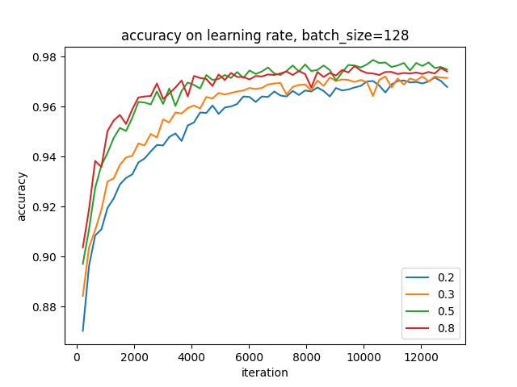
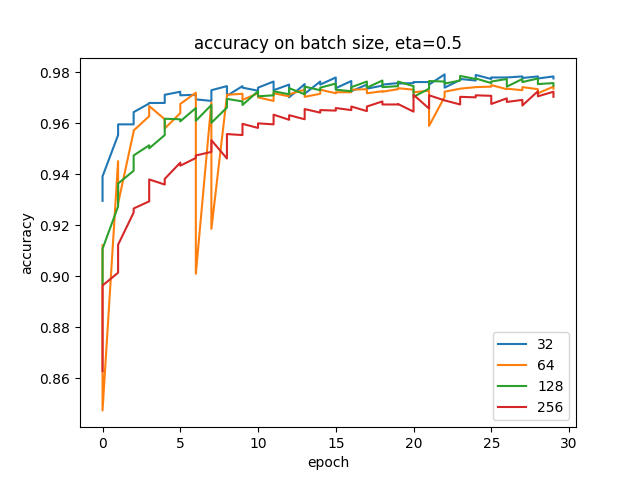
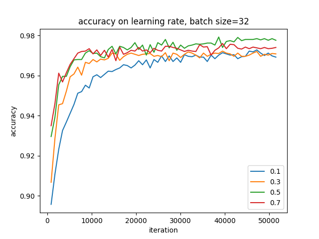


## 14.0 搭建深度神经网络框架 ##
迷你框架的模块化设计如下图所示：


                图14-1 迷你框架设计

- `NeuralNet`类：包装基本的神经网络结构和功能

- `Layers` - 神经网络各层的容器，按添加顺序维护一个列表
- `Parameters` - 基本参数，包括普通参数和超参
- `Loss Function` - 提供计算损失函数值，存储历史记录并最后绘图的功能
- `LayerManagement()` - 添加神经网络层
- `ForwardCalculation()` - 调用各层的前向计算方法
- `BackPropagation()` - 调用各层的反向传播方法
- `PreUpdateWeights()` - 预更新各层的权重参数
- `UpdateWeights()` - 更新各层的权重参数
- `Train()` - 训练
- `SaveWeights()` - 保存各层的权重参数
- `LoadWeights()` - 加载各层的权重参数

## 14.1 回归任务功能测试 ##
### 搭建模型 ###
搭建一个双层的神经网络，第一层后面接一个Sigmoid激活函数，第二层直接输出拟合数据，如图所示：


                图14-2 完成拟合任务的抽象模型

### 代码实现 ###


                图ch04-level1-1

如图ch04-level1-1 所示，损失函数值在一段平缓期过后，开始陡降。


                图ch04-level1-2

图ch04-level1-2 绿色点为测试集数据，红色点为神经网路推理结果。显然除了最左侧开始的部分，其它部分都拟合得很好。

## 14.2 回归任务 - 房价预测
### 搭建模型 ###
建立一模型包含四组全连接层-Relu层的组合，最后一个单输出做拟合。


                图14-3 完成房价预测任务的抽象模型

### 代码实现 ###
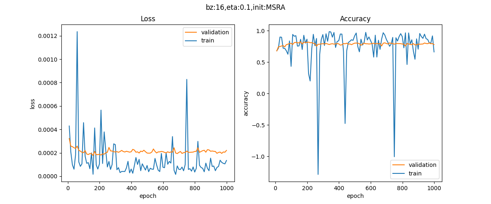

                图ch04-level2-1


                图ch04-level2-2

由图可得，损失函数值下降，而精度值在不断的上升。

## 14.3 二分类任务功能测试 ##
### 搭建模型 ###
搭建一个双层的神经网络，第一层后面接一个Sigmoid激活函数，第二层直接输出拟合数据，最后接一个Logistic二分类函数用于完成二分类任务，如图14-4所示。


                图14-4 完成非线性二分类教学案例的抽象模型
### 代码实现 ###


                图ch04-level3-1

图ch04-level3-1 记录了训练过程中损失函数值和准确率的变化。

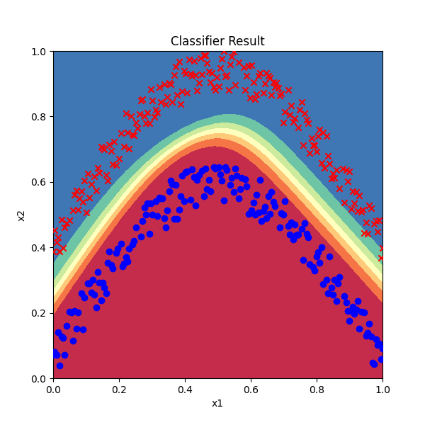

                图ch04-level3-2

图ch04-level3-2 展现出分类效果。

## 14.4 二分类任务真实案例 ##
### 搭建模型 ###
建立一模型包含四组全连接层-Relu层的组合，单输出做拟合，在最后接一个Logistic函数用于完成二分类任务。


                图14-5 完成二分类真实案例的抽象模型


                图ch04-level4-1

图ch04-level4-1 所示。左边为是损失函数图，右边为准确率图。忽略测试数据的波动，只看红色的验证集的趋势，损失函数值不断下降，准确率不断上升。

## 14.5 多分类功能测试 ##
### 搭建模型一 ###
使用Sigmoid做为激活函数的两层网络，如图所示：


                图14-6 完成非线性多分类教学案例的抽象模型
### 代码实现一 ###


                图ch04-level5-1

图ch04-level5-1 展现出模型一训练过程中损失函数值和准确率的变化。

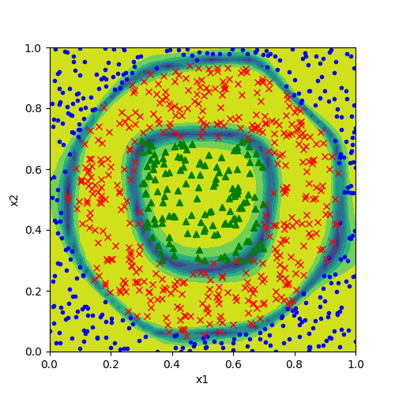

                图ch04-level5-2

图ch04-level5-2 展现出模型一训练结果分类效果。

### 搭建模型二 ###
使用ReLU做为激活函数的三层网络，如图所示：


图14-7 使用ReLU函数抽象模型

### 运行结果二 ###
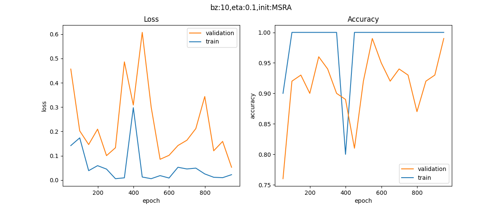

                图ch04-level5-3

图ch04-level5-3 展现出模型二训练过程中损失函数值和准确率的变化。

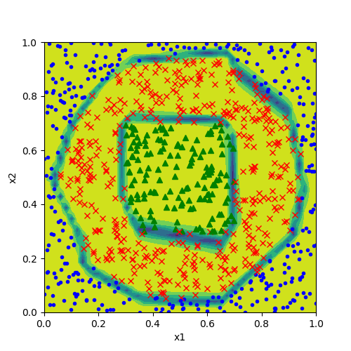

                图ch04-level5-4

图ch04-level5-4 展现出模型一训练结果分类效果。

## 14.6 多分类任务 - MNIST手写体识别 ##
### 搭建模型 ###

搭建一个共含4个隐层的模型，隐层间都用ReLU激活函数连接，最后的输出层接Softmax分类函数。搭建模型如图所示：


                图14-8 完成MNIST分类任务的抽象模型

## 15.1 权重矩阵初始化 ##
权重矩阵初始化是训练神经网络的第一步，选择正确的初始化方法尤为重要。每次重新初始化时会给训练结果带来影响。

### 零初始化 ###
即把所有层的`W`值的初始值都设置为0。

$$
W = 0
$$

**注**：对于多层网络不能用零初始化，否则权重值不能学习到合理的结果。

### 标准初始化 ###
标准正态初始化方法保证激活函数的输入均值为0，方差为1。

$$
W \sim N \begin{bmatrix} 0, 1 \end{bmatrix}
$$

其中：
1. W：权重矩阵
2. N：高斯分布

### Xavier初始化方法 ###
正向传播时，激活值的方差保持不变；反向传播时，关于状态值的梯度的方差保持不变。


$$
W \sim N
\begin{pmatrix}
0, \sqrt{\frac{2}{n_{in} + n_{out}}} 
\end{pmatrix}
$$

$$
W \sim U 
\begin{pmatrix}
 -\sqrt{\frac{6}{n_{in} + n_{out}}}, \sqrt{\frac{6}{n_{in} + n_{out}}} 
\end{pmatrix}
$$

其中：
W：权重矩阵
N：正态分布（Normal Distribution）
U：均匀分布（Uniform Distribution)

### MSRA初始化方法（He方法） ###
正向传播时，状态值的方差保持不变；反向传播时，关于激活值的梯度的方差保持不变。

只考虑输入个数时，MSRA初始化是一个均值为0，方差为2/n的高斯分布，适合于ReLU激活函数：

$$
W \sim N 
\begin{pmatrix} 
0, \sqrt{\frac{2}{n}} 
\end{pmatrix}
$$

$$
W \sim U 
\begin{pmatrix} 
-\sqrt{\frac{6}{n_{in}}}, \sqrt{\frac{6}{n_{out}}} 
\end{pmatrix}
$$

### 小结 ###

                表15-1 几种初始化方法的应用场景

|ID|网络深度|初始化方法|激活函数|说明|
|---|---|---|---|---|
|1|单层|零初始化|无|可以|
|2|双层|零初始化|Sigmoid|错误，不能进行正确的反向传播|
|3|双层|随机初始化|Sigmoid|可以|
|4|多层|随机初始化|Sigmoid|激活值分布成凹形，不利于反向传播|
|5|多层|Xavier初始化|Tanh|正确|
|6|多层|Xavier初始化|ReLU|激活值分布偏向0，不利于反向传播|
|7|多层|MSRA初始化|ReLU|正确|

由表可得，由于网络深度和激活函数的变化，使得人们不断地研究新的初始化方法来适应，最终得到1、3、5、7几种组合。

### 代码实现 ###


                图ch15-level1-1

图ch15-level1-1 为标准初始化在Sigmoid激活函数上的表现。
图中是一个6层的深度网络，使用全连接层+Sigmoid激活函数，图中表示的是各层激活函数的直方图。可以看到各层的激活值严重向两侧[0,1]靠近，从Sigmoid的函数曲线可以知道这些值的导数趋近于0，反向传播时的梯度逐步消失。处于中间地段的值比较少，对参数学习是十分不利的。

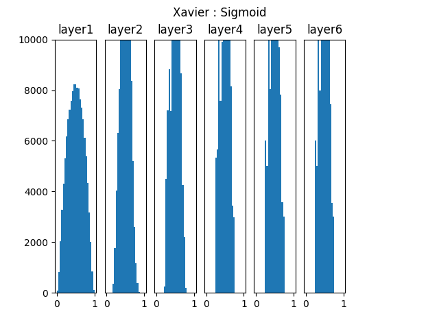

                图ch15-level1-2

图ch15-level1-2 为Xavier初始化在Sigmoid激活函数上的表现。
图中是深度为6层的网络中的表现情况。后面几层的激活函数输出值的分布仍然基本符合正态分布，有利于神经网络的学习。


                图ch15-level1-3

图ch15-level1-3是Xavier初始化在ReLU激活函数上的表现。由图易得，随着层的加深，使用ReLU时激活值逐步向0偏向，同样会导致梯度消失问题。


                图ch15-level1-4

图ch15-level1-4 为MSRA初始化在ReLU激活函数上的表现。

## 15.2 梯度下降优化算法 ##
### 代码实现 ###

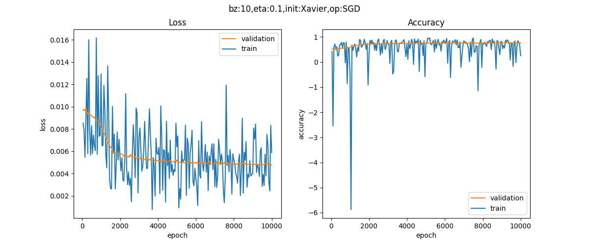

                图ch15-level2-1


                图ch15-level2-2


                图ch15-level2-3

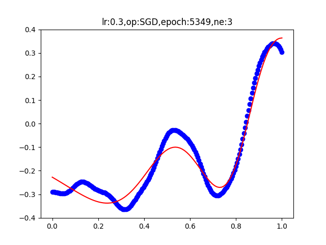

                图ch15-level2-4

图ch15-level2-1 至 图ch15-level2-4 四个图像分别为 $eta$ 取值 $0.1$ 和 $0.3$ 时通过 $SDG算法$ 得到的损失函数和准确率。
可得 $eta$ 取值越大准确率越高。


                图ch15-level2-5


                图ch15-level2-6


                图ch15-level2-7


                图ch15-level2-8

图ch15-level2-1 至 图ch15-level2-4 四个图像分别为通过 $Momentum$ 和 $Nag$ 算法得到的损失函数和准确率。

## 15.3 自适应学习率算法
### 代码实现 ###
                表2 AdaGrad算法损失函数值变化
|初始学习率|损失函数值变化|
|---|---|
|eta=0.3||
|eta=0.5||
|eta=0.7||

                表3 AdaGrad算法准确率变化

|初始学习率|与目标结果关系变化|
|---|---|
|eta=0.3||
|eta=0.5||
|eta=0.7||

                表4 AdaDelta算法损失函数值变化
|初始学习率|损失函数值变化|
|---|---|
|eta=0.1||
|eta=0.01||


                表5 AdaDelta算法准确率变化

|初始学习率|与目标结果关系变化|
|---|---|
|eta=0.1||
|eta=0.01||

                表6 RMSProp算法损失函数值变化
|初始学习率|损失函数值变化|
|---|---|
|eta=0.1||
|eta=0.01||
|eta=0.005||

                表7 RMSProp算法准确率变化

|初始学习率|与目标结果关系变化|
|---|---|
|eta=0.1||
|eta=0.01||
|eta=0.005||

## 15.4 算法在等高线图上的效果比较 ##

                表8 各种算法的效果比较

|||
|---|---|
||
|SGD当学习率为0.1时，需要很多次迭代才能逐渐向中心靠近|SGD当学习率为0.5时，会比较快速地向中心靠近，但是在中心的附近有较大震荡|
|||
|Momentum由于惯性存在，一下子越过了中心点，但是很快就会得到纠正|Nag是Momentum的改进，有预判方向功能|
|||
|AdaGrad的学习率在开始时可以设置大一些，因为会很快衰减|AdaDelta即使把学习率设置为0，也不会影响，因为有内置的学习率策略|
|||
|RMSProp解决AdaGrad的学习率下降问题，即使学习率设置为0.1，收敛也会快|Adam到达中点的路径比较直接|

## 15.5 批量归一化的原理 ##
### 正态分布(高斯分布) ###
若随机变量$X$，服从一个位置参数为$\mu$、尺度参数为$\sigma$的概率分布，且其概率密度函数为：

$$
f(x)=\frac{1}{\sigma\sqrt{2 \pi} } e^{- \frac{{(x-\mu)^2}}{2\sigma^2}} 
$$

则这个随机变量就称为正态随机变量，正态随机变量服从的分布就称为正态分布，记作：

$$
X \sim N(\mu,\sigma^2)  
$$

当μ=0,σ=1时，称为标准正态分布：

$$X \sim N(0,1) $$

此时公式简化为：

$$
f(x)=\frac{1}{\sqrt{2 \pi}} e^{- \frac{x^2}{2}} 
$$

#### 代码实现 ###


                图ch15-level5-1

图ch15-level5-1为三种（$\mu,\sigma$）组合的函数图像。

### 深度神经网络的挑战 ###
#### 代码实现 ####


                图ch15-level5-2

图ch15-level5-2为偏移后的数据分布区域和Sigmoid激活函数图像。


                图ch15-level5-3

图ch15-level5-3为ReLU函数曲线.
图中蓝色为数据分布，已经从0点向右偏移了，黄色为ReLU的激活值，可以看到95%以上的数据都在大于0的区域，从而被Relu激活函数原封不动第传到了下一层网络中，而没有被小于0的部分剪裁。该网络和线性网络基本失去深层网络的能力。

## 16.0 过拟合 ##
正则化用于防止过拟合。

**出现过拟合的原因：**
1. 训练集的数量和模型的复杂度不匹配，样本数量级小于模型的参数
2. 训练集和测试集的特征分布不一致
3. 样本噪音大，使得神经网络学习到了噪音，正常样本的行为被抑制
4. 迭代次数过多，过分拟合了训练数据，包括噪音部分和一些非重要特征

### 代码实现 ###


                图ch16-level0-1


                图ch16-level0-2


                图ch16-level1-1
                


                图ch16-level1-2

## 16.1 偏差与方差 ##

                表9 符号含义

|符号|含义|
|---|---|
|$x$|测试样本|
|$D$|数据集|
|$y$|x的真实标记|
|$y_D$|x在数据集中标记(可能有误差)|
|$f$|从数据集D学习的模型|
|$f_{x;D}$|从数据集D学习的模型对x的预测输出|
|$f_x$|模型f对x的期望预测输出|

- 学习算法期望的预测：
$$f_x=E[f_{x;D}]  $$
- 不同的训练集/验证集产生的预测方差：
$$var(x)=E[(f_{x;D}-f_x)^2]  $$
- 噪声：
$$\epsilon^2=E[(y_D-y)^2]  $$
- 期望输出与真实标记的偏差：
$$bias^2(x)=(f_x-y)^2  $$
- 算法的期望泛化误差：
$$
\begin{aligned}
E(f;D)&=var(x) + bias^2(x) + \epsilon^2
\end{aligned}
$$

- 各个项的含义为：

1. 偏差：度量了学习算法的期望与真实结果的偏离程度，即学习算法的拟合能力。
2. 方差：训练集与验证集的差异造成的模型表现的差异。
3. 噪声：当前数据集上任何算法所能到达的泛化误差的下线，即学习问题本身的难度。

**算法的期望泛化误差公式证明**


            图 算法期望泛化误差公式证明
## 16.2 L2正则 ##
### 损失函数的变化 ###

假设是均方差损失函数：

$$J(w,b)=\frac{1}{2m}\sum_{i=1}^m (z_i-y_i)^2 + \frac{\lambda}{2m}\sum_{j=1}^n{w_j^2} $$

如果是交叉熵损失函数：

$$J(w,b)= -\frac{1}{m} \sum_{i=1}^m [y_i \ln a_i + (1-y_i) \ln (1-a_i)]+ \frac{\lambda}{2m}\sum_{j=1}^n{w_j^2} $$

### 代码实现 ###


                图ch16-level2-1

图ch16-level2-1为训练过程中损失函数值和准确率的变化曲线。


                图ch16-level2-2

图ch16-level2-2为拟合后的曲线与训练数据的分布图。


## 16.3 L1正则 ##
**拉普拉斯分布**
$$
\begin{aligned}
f(x)&=\frac{1}{2b}\exp(-\frac{|x-\mu|}{b})\\\\
&= \frac{1}{2b} \begin{cases} \exp(\frac{x-\mu}{b}), & x \lt \mu \\\\ \exp(\frac{\mu-x}{b}), & x \gt \mu \end{cases}
\end{aligned}
$$

### 代码实现 ###


                图ch16-level3-1

图ch16-level3-1为训练过程中损失函数值和准确率的变化曲线。


                图ch16-level3-2

图ch16-level3-2为拟合后的曲线与训练数据的分布图。

## 16.4 早停法 Early Stopping ##
**早停法**实际上也是一种正则化的策略，可以理解为在网络训练不断逼近最优解的过程种，在梯度等高线的外围就停止了训练。
算法描述如下：

***

```
初始化
    初始权重均值参数：theta = theta_0
    迭代次数：i = 0
    忍耐次数：patience = N (e.g. N=10)
    忍耐次数计数器：counter = 0
    验证集损失函数值：lastLoss = 10000 (给一个特别大的数值)

while (epoch < maxEpoch) 循环迭代训练过程
    正向计算，反向传播更新theta
    迭代次数加1：i++
    计算验证集损失函数值：newLoss = loss
    if (newLoss < lastLoss) // 新的损失值更小
        忍耐次数计数器归零：counter = 0
        记录当前最佳权重矩阵训练参数：theta_best = theta
        记录当前迭代次数：i_best = i
        更新最新验证集损失函数值：lastLoss = newLoss
    else // 新的损失值大于上一步的损失值
        忍耐次数计数器加1：counter++
        if (counter >= patience) 停止训练！！！
    end if
end while
```

***

### 代码实现 ###


                图ch16-level4-1

图ch16-level4-1为训练过程中损失函数值和准确率的变化曲线。


                图ch16-level4-2

图ch16-level4-2为拟合后的曲线与训练数据的分布图。

## 16.5 丢弃法 Dropout ##
**代码**

```Python
class DropoutLayer(CLayer):
    def __init__(self, input_size, ratio=0.5):
        self.dropout_ratio = ratio
        self.mask = None
        self.input_size = input_size
        self.output_size = input_size

    def forward(self, input, train=True):
        assert(input.ndim == 2)
        if train:
            self.mask = np.random.rand(*input.shape) > self.dropout_ratio
            self.z = input * self.mask
        else:
            self.z = input * (1.0 - self.dropout_ratio)

        return self.z
       
    def backward(self, delta_in, idx):
        delta_out = self.mask * delta_in
        return delta_out
```

### 代码实现 ###


                图ch16-level5-1

图ch16-level4-1为训练过程中损失函数值和准确率的变化曲线。


                图ch16-level5-2

图ch16-level4-2为拟合后的曲线与训练数据的分布图。

## 16.6 数据增强 Data Augmentation ##
### SamplePairing

SamplePairing方法的处理流程如下图所示，从训练集中随机抽取两张图片分别经过基础数据增强操作（如随机翻转等）处理后经像素取平均值的形式叠加合成一个新的样本，标签为原样本标签中的一种。


图  SamplePairing方法的处理流程

### 代码实现 ###


                图ch16-level6-1

## 16.7 集成学习 Ensemble Learning ##
当数据集有问题，或者网络学习能力不足，或准确度不够时，就可以采取集成学习的方法来提升性能。
下是一个简单的集成学习的示意图。


                图16-7.1 集成学习的示意图

### Bagging法集成学习的基本流程 ###
下是Bagging集成学习的示意图。


图16-7.2 Bagging集成学习示意图

### 集成方法选择 ###
**平均法**

在回归任务中，输出为一个数值，可以使用平均法来处理多个神经网络的输出值。下面公式中的$h_i(x)$表示第i个神经网络的输出，$H(x)$表示集成后的输出。

- 简单平均法：所有值加起来除以N。
  $$H(x)=\frac{1}{N} \sum_{i=1}^N h_i(x)$$

- 加权平均法：给每个输出值一个人为定义的权重。
$$H(x)=\sum_{i=1}^N w_i \cdot h_i(x)$$

**投票法**

对于分类任务，将会从类别标签集合$\\{c_1, c_2, ...,c_n\\}$中预测出一个值，多个神经网络可能会预测出不一样的值，此时可以采样投票法。

- 绝对多数投票法（majority voting）

    当有半数以上的神经网路预测出同一个类别标签时，我们可以认为此预测有效。如果少于半数，则可以认为预测无效。

- 加权投票法(weighted voting)

    与加权平均法类似。

- 相对多数投票法（plurality voting）

    即得票最多的标签获胜。如果有多个标签获得相同的票数，随机选一个。

**学习法**
学习法即用另外一个神经网络，通过训练的方式，将神经网路的输出结果作为输入，把图片的真实数字作为标签，得到一个强学习器。